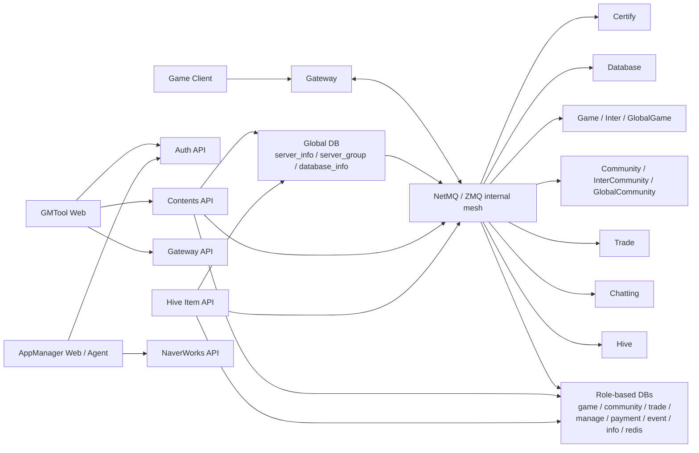
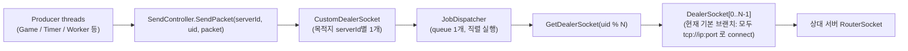
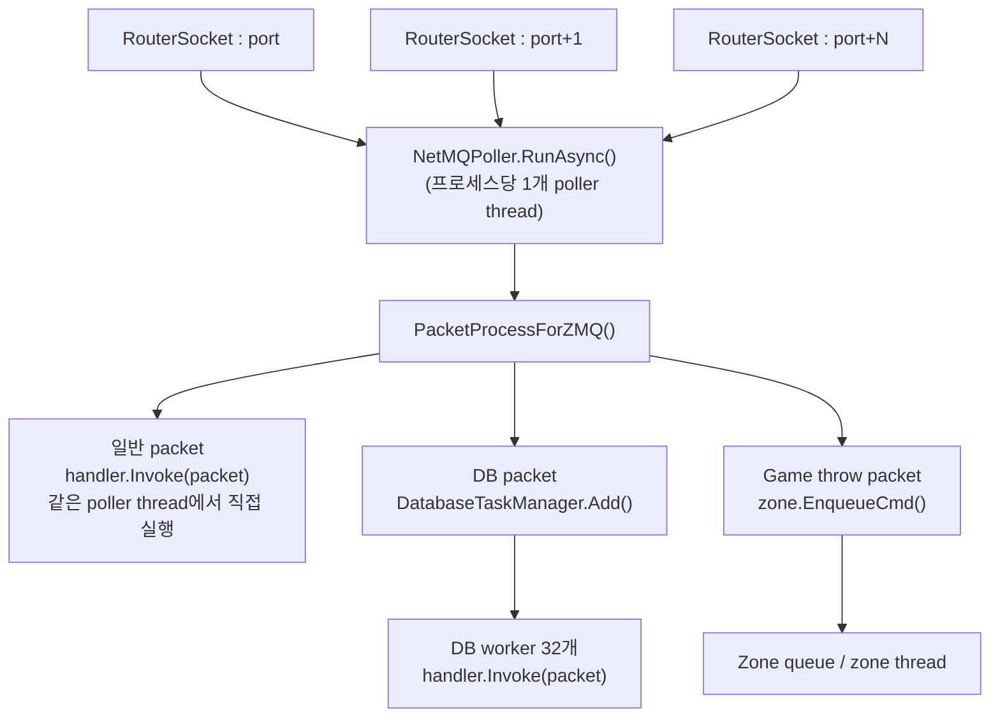
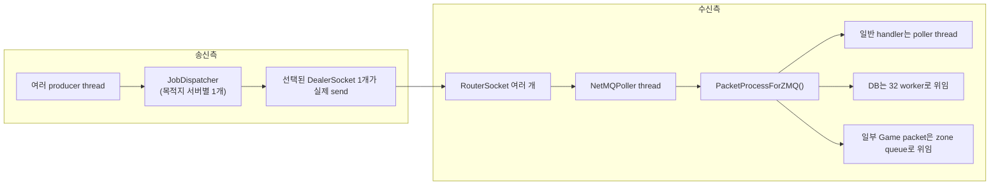

# 서버 코드 기반 현재 구성도 확인

- Project: Astellia
- Session ID: `019d9918-5a62-7ad1-b389-4de899e31db9`
- Workspace: `E:\ProjectA02\Trunk\Dev`
- Started: 2026-04-17T01:40:03.344Z
- Updated: 2026-04-17T01:40:21.0921802Z
- Messages exported: 24

> Export note: internal system/developer instructions, tool execution logs, and base64 image payloads are omitted. Only user/assistant messages are archived.

## Conversation

### User

<environment_context>
  <cwd>E:\ProjectA02\Trunk\Dev</cwd>
  <shell>powershell</shell>
  <current_date>2026-04-17</current_date>
  <timezone>Asia/Seoul</timezone>
</environment_context>

### User

서버 코드를 바탕으로 현재의 서버 구성도를 확인해 주세요.

### Assistant

서버 코드를 기준으로 현재 구성도를 파악해볼게요. 먼저 프로젝트 구조와 서버 진입점, 라우팅/서비스/인프라 연결 지점을 빠르게 훑어서 실제 배포 관점의 구성으로 정리하겠습니다.

### Assistant

상위 구조를 보니 `Server`와 `WebServer`가 분리되어 있어서 둘 다 서버 계층으로 보입니다. 이제 각 디렉터리의 진입점과 네트워크/DB 연결 지점을 확인해서 실제 구성 요소 관계를 묶어보겠습니다.

### Assistant

전체 파일 수가 많아서 핵심 진입점 중심으로 좁히고 있습니다. 이번에는 솔루션/프로젝트 참조와 `Program`, `Startup`, 설정 파일을 읽어서 서비스 간 연결을 실제 코드 기준으로 묶겠습니다.

### Assistant

핵심은 `EgonServer`가 게임 서버 본체인지, `WebServer` 쪽이 어떤 API/운영 도구를 붙이는지 확인하는 거예요. 지금부터 실행 진입점과 설정 파일을 같이 읽어서 포트/프로토콜/외부 의존성까지 뽑아보겠습니다.

### Assistant

이제부터는 구성도를 그리는 데 필요한 코드 조각만 읽고 있어요. `EgonServer` 본체, 웹 API들, 그리고 배포용 `Patch/Config`의 서비스 URL 설정을 함께 보고 실제 연결 방향을 확정하겠습니다.

### Assistant

웹 API 쪽도 구조가 분리되어 있는 게 보입니다. `ItemAPI`는 결제/아이템성 Hive 연동 축이고, `GmTool` 계열은 인증/API/웹 UI/게이트웨이로 따로 쪼개진 형태라서 이 축을 추가 확인 중입니다.

### Assistant

코드상 웹 API가 단순 CRUD인지, 게임 서버와 직접 소켓으로 붙는지까지 분리해서 보려면 호출 지점을 확인해야 해요. 이제 `SocketManager`, `ConfigHelper`, API 컨트롤러 참조를 보면 웹 계층이 DB만 보는지 게임 서버까지 건드리는지 확정됩니다.

### Assistant

게임 서버 축은 단일 프로세스가 아니라 서버 타입별 멀티 프로세스일 가능성이 높아서, 시작 스크립트도 같이 보고 있어요. 여기서 `Certify / Gateway / Game / Community / Trade / Hive` 같은 실제 띄우는 조합을 확인할 수 있습니다.

### Assistant

주요 축은 거의 잡혔고, 마지막으로 보조 서비스만 확인하고 있어요. `AppManager`, `NaverWorks`, `BI`, 배경 에이전트가 실제 운영 구성도에 들어가야 하는지 구분해서 최종 그림을 깔끔하게 정리하겠습니다.

### Assistant

노드 타입과 DB 역할명도 교차 확인 중입니다. 이 부분까지 보면 “게임 서버군 / 웹 API군 / 운영 지원군”을 더 정확하게 나눌 수 있어요.

### Assistant

현재 코드를 기준으로 보면 서버는 `DB 주도형 멀티 프로세스 게임 서버 + 별도 운영 웹 스택` 구조입니다. 핵심은 `EgonServer.exe`가 서버 역할을 하드코딩하지 않고, 글로벌 DB의 `server_info / server_group / database_info`를 읽어 각 프로세스의 타입, 클라이언트 포트, ZMQ 내부통신 주소를 결정한다는 점입니다 ([ServerModule.cs](<E:\ProjectA02\Trunk\Dev\Server\EgonServer\Server\ServerModule.cs:275>), [ServerInfoEntity.cs](<E:\ProjectA02\Trunk\Dev\Server\EgonServer\Database\Entities\ServerInfoEntity.cs:12>), [DatabaseInfoEntity.cs](<E:\ProjectA02\Trunk\Dev\Server\EgonServer\Database\Entities\DatabaseInfoEntity.cs:11>), [Program.cs](<E:\ProjectA02\Trunk\Dev\Server\EgonServer\Program.cs:187>), [ServerController.cs](<E:\ProjectA02\Trunk\Dev\Server\EgonServer\Controllers\ServerController.cs:274>)).

노드 역할은 코드에 `Certify`, `Database`, `Gateway`, `Game`, `Inter`, `GlobalGame`, `Community`, `InterCommunity`, `GlobalCommunity`, `Trade`, `Chatting`, `Hive`, `Develop`까지 분리되어 있습니다 ([NodeConfiguration.cs](<E:\ProjectA02\Trunk\Dev\Server\EgonServer\ServerNodes\NodeConfiguration.cs:61>)). QA용 시작 스크립트 예시는 `Certify 1 + Gateway 3 + Database 1 + Community 1 + Game 1 + Chatting 1 + Trade 1 + Inter 1 + Develop 1`이고 ([3.start.bat](<E:\ProjectA02\Trunk\Dev\Server\3.start.bat:3>)), 일반 시작 스크립트는 `server_info`에서 `state=1`인 서버명을 읽어 전부 띄우므로 실제 운영 인스턴스 수는 환경 DB 기준으로 바뀝니다 ([startserver.ps1](<E:\ProjectA02\Trunk\Dev\Server\startserver.ps1:3>)). 즉, “현재 구성도”는 정적 파일보다 글로벌 DB가 사실상 소스 오브 트루스입니다.

웹 운영 스택은 별도입니다. `RP.GmTool.Egon.Web`은 `Auth API / Contents API / Gateway API`를 호출하고 ([appsettings.json](<E:\ProjectA02\Trunk\Dev\WebServer\RP.GmTool.Egon.Web\RP.GmTool.Egon.Web\appsettings.json:13>), [AuthRepository.cs](<E:\ProjectA02\Trunk\Dev\WebServer\RP.GmTool.Egon.Web\RP.GmTool.Egon.Web\Models\AuthRepository.cs:24>), [ContentsRepository.cs](<E:\ProjectA02\Trunk\Dev\WebServer\RP.GmTool.Egon.Web\RP.GmTool.Egon.Web\Models\ContentsRepository.cs:21>), [GatewayRepository.cs](<E:\ProjectA02\Trunk\Dev\WebServer\RP.GmTool.Egon.Web\RP.GmTool.Egon.Web\Models\GatewayRepository.cs:19>)), `Contents API`는 글로벌 DB에서 대상 서버 목록을 조회한 뒤 Certify/Community/GlobalCommunity 쪽으로 운영 패킷을 전송합니다 ([ServerSocketGateway.cs](<E:\ProjectA02\Trunk\Dev\WebServer\RP.GmTool.Egon.API\RP.GmTool.Egon.API\Base\ServerSocketGateway.cs:22>), [GlobalRepository.cs](<E:\ProjectA02\Trunk\Dev\WebServer\RP.GmTool.Egon.API\RP.GmTool.Egon.API\Models\GlobalRepository.cs:39>), [NewSocketManager.cs](<E:\ProjectA02\Trunk\Dev\WebServer\RP.GmTool.Egon.API\RP.GmTool.Socket\NewSocketManager.cs:44>)). `RP.Egon.ItemAPI`도 글로벌/결제/이벤트 DB를 쓰면서 필요 시 게임 서버로 패킷을 보냅니다 ([RP.Egon.ItemAPI.csproj](<E:\ProjectA02\Trunk\Dev\WebServer\RP.Hive.Egon.API\RP.Egon.ItemAPI.csproj:36>), [EgonController.cs](<E:\ProjectA02\Trunk\Dev\WebServer\RP.Hive.Egon.API\Controllers\EgonController.cs:239>), [NewSocketManager.cs](<E:\ProjectA02\Trunk\Dev\WebServer\RP.Hive.Socket\NewSocketManager.cs:53>)). 배포 스크립트 기준 웹 포트는 `Auth 9591`, `Contents 9592`, `GMTool Web 9595`, `ItemAPI 30114`, `Gateway API 8282`입니다 ([pm2_start.sh](<E:\ProjectA02\Trunk\Dev\WebServer\pm2_start.sh:8>)). 다만 체크인된 `GMTool Web` 로컬 설정은 다른 디버그 포트를 가리켜서 로컬/배포 설정이 분리돼 있습니다 ([appsettings.json](<E:\ProjectA02\Trunk\Dev\WebServer\RP.GmTool.Egon.Web\RP.GmTool.Egon.Web\appsettings.json:16>), [pm2_start.sh](<E:\ProjectA02\Trunk\Dev\WebServer\pm2_start.sh:8>)).

원하시면 다음 단계로 이어서 해드릴 수 있습니다.
1. 이 구조를 기준으로 `PNG/Draw.io용 구성도` 형태로 다시 정리
2. `환경별(QA/Review/Live)` 인스턴스 수까지 추정
3. `서버 간 호출 흐름(로그인, 우편, GM 명령)` 시퀀스 다이어그램으로 정리

### User

서버간 통신(zmq)은 어떻게 하고 있나요? 
ex) 수신 쓰레드는 1개이고 전송쓰레드는 여러개인지? 
    queue 방식으로 소켓을 넣었다 전송하는 것인지? 
    소켓의 우선순위가 있는 것인지? 
    소켓이 지연되면 소멸 되는 것인지? 
    멀티쓰레드에서 동작하는 것인지? 
    멀티쓰레드에서 동작시 문제되는 부분은 없는 것인지? 
    클라이언트에 전송시 패킷 순서는 보장되는지? 
그외에 일반적으로 체크해야 할 항목이 있으면 추가로 확인해 주세요.

### Assistant

이번에는 ZMQ 통신 경로를 코드 레벨로 좁혀서 보겠습니다. 수신/전송 스레드 구조, 큐 사용 여부, 지연 시 동작, 멀티스레드 안전성, 순서 보장까지 `ServerController`, `SendController`, 패킷 디스패치 경로를 따라 확인할게요.

### Assistant

핵심 클래스들을 읽어보니 ZMQ 수신은 `RouterSocket + NetMQPoller`, 전송은 `DealerSocket + JobDispatcher` 조합으로 보입니다. 지금부터 실제 큐잉 방식과 스레드 모델, 순서 보장을 판단할 수 있는 메서드 본문을 확인하겠습니다.

### Assistant

이제 거의 답을 낼 수 있는 상태예요. 마지막으로 실제 빌드 기준에서 `customSocketCount`가 몇 개인지와, 수신 콜백이 어디까지 직접 처리하는지 확인해서 “현재 설정”과 “잠재 리스크”를 분리해 설명하겠습니다.

### Assistant

현재 빌드 기준으로 ZMQ 송수신 경로와 쓰레드 모델을 코드에서 직접 따라가고 있습니다. 먼저 `ServerController`/`SendController`/`ServerModule`에서 실제 소켓 생성과 poller 구조를 확인하고, 이어서 `Session`/`JobDispatcher`까지 내려가서 순서 보장과 멀티쓰레드 리스크를 정리하겠습니다.

### Assistant

`rg` 실행이 이 환경에서 막혀 있어서 PowerShell 기본 검색으로 전환했습니다. 핵심 파일들의 라인 위치를 다시 뽑아 정리한 뒤, 질문하신 항목별로 현재 빌드 기준 결론과 리스크를 묶어서 드리겠습니다.

### Assistant

소켓 개수만 보면 송수신이 병렬처럼 보이지만, 실제로는 poller와 dispatcher가 어디에서 직렬화하는지가 더 중요합니다. 그 부분을 확인하려고 `BindRouter`, `CustomDealerSocket.PostPacket`, `JobActorExtension.Post`, `Session.PostPacket`, `ServerStatusInfoManager.CheckServerStatus` 주변을 다시 열어보고 있습니다.

### Assistant

체크인된 `Debug/Release` 설정 기준으로는 `NETMQ_TH_USE`, `NETMQ_SVR_TYPE_USE`가 정의되어 있지 않아서 현재 실제 경로는 기본 `#else` 브랜치입니다. 즉 아래 평가는 “현재 코드 그대로 빌드했을 때” 기준입니다 ([EgonServer.csproj](<E:\ProjectA02\Trunk\Dev\Server\EgonServer\EgonServer.csproj:18>), [EgonServer.csproj](<E:\ProjectA02\Trunk\Dev\Server\EgonServer\EgonServer.csproj:26>)).

**질문별 답변**
- 수신은 현재 빌드 기준 `RouterSocket`이 여러 개여도 `NetMQPoller`는 1개입니다. `Release`는 `customSocketCount=10`, `Debug`는 `1`인데, 이 소켓들을 모두 단일 `_serverPoller`에 넣고 `RunAsync()`를 한 번만 호출합니다. 그래서 “수신 쓰레드 1개 + 수신 소켓 여러 개”에 가깝습니다 ([ServerController.cs](<E:\ProjectA02\Trunk\Dev\Server\EgonServer\Controllers\ServerController.cs:46>), [ServerController.cs](<E:\ProjectA02\Trunk\Dev\Server\EgonServer\Controllers\ServerController.cs:48>), [ServerController.cs](<E:\ProjectA02\Trunk\Dev\Server\EgonServer\Controllers\ServerController.cs:162>), [ServerController.cs](<E:\ProjectA02\Trunk\Dev\Server\EgonServer\Controllers\ServerController.cs:167>), [ServerController.cs](<E:\ProjectA02\Trunk\Dev\Server\EgonServer\Controllers\ServerController.cs:344>), [ServerController.cs](<E:\ProjectA02\Trunk\Dev\Server\EgonServer\Controllers\ServerController.cs:376>)).
- 전송은 “전송 쓰레드 여러 개”보다는 “여러 producer thread가 1개의 dispatcher에 넣고, 실제 소켓 send는 직렬화” 구조입니다. 원격 서버마다 `CustomDealerSocket` 하나가 있고, 그 안에 `DealerSocket[]`은 여러 개일 수 있지만 `JobDispatcher`는 1개뿐입니다 ([SendController.cs](<E:\ProjectA02\Trunk\Dev\Server\EgonServer\Controllers\SendController.cs:107>), [ServerController.cs](<E:\ProjectA02\Trunk\Dev\Server\EgonServer\Controllers\ServerController.cs:2115>), [ServerController.cs](<E:\ProjectA02\Trunk\Dev\Server\EgonServer\Controllers\ServerController.cs:2117>), [ServerController.cs](<E:\ProjectA02\Trunk\Dev\Server\EgonServer\Controllers\ServerController.cs:2420>)).
- queue 방식은 “소켓을 queue에 넣는 방식”은 아니고, “send job을 queue에 넣는 방식”입니다. `PostPacket()`이 `JobActorExtension.Post()`를 통해 `JobDispatcher`의 `ConcurrentQueue`에 작업을 넣고, 거기서 `TrySendFrame()`을 수행합니다 ([JobActorExtension.cs](<E:\ProjectA02\Trunk\Dev\Server\Engine\K2.Core\Messaging\Detail\JobActorExtension.cs:21>), [JobDispatcher.cs](<E:\ProjectA02\Trunk\Dev\Server\Engine\K2.Core\Messaging\JobDispatcher.cs:19>), [JobDispatcher.cs](<E:\ProjectA02\Trunk\Dev\Server\Engine\K2.Core\Messaging\JobDispatcher.cs:100>), [ServerController.cs](<E:\ProjectA02\Trunk\Dev\Server\EgonServer\Controllers\ServerController.cs:2337>)).
- 소켓 우선순위는 없습니다. 패킷별 우선순위 큐도 없고, 소켓별 priority 설정도 없습니다. 다만 패킷 종류에 따라 `TrySendFrameSec`만 다르게 줍니다. 예를 들어 저장류 5초, 랭킹 15초, 서버 이동류 10초입니다. 이는 “우선순위 스케줄링”이 아니라 “얼마나 오래 보내보느냐” 차이입니다 ([ServerController.cs](<E:\ProjectA02\Trunk\Dev\Server\EgonServer\Controllers\ServerController.cs:2368>), [ServerController.cs](<E:\ProjectA02\Trunk\Dev\Server\EgonServer\Controllers\ServerController.cs:2392>), [ServerController.cs](<E:\ProjectA02\Trunk\Dev\Server\EgonServer\Controllers\ServerController.cs:2398>), [ServerController.cs](<E:\ProjectA02\Trunk\Dev\Server\EgonServer\Controllers\ServerController.cs:2410>)).
- 지연되면 메시지가 보존되지는 않습니다. `DealerSocket`은 `SendHighWatermark=100`, `Linger=0`이고, `TrySendFrame()` 실패 시 로그만 남기고 반환합니다. 별도 재시도 큐나 영속 큐는 없습니다. 서버 상태는 heartbeat 기준으로 `Open -> Delayed -> Closed`로 바뀌고, 소켓이 닫힌 것으로 판단되면 재연결을 시도합니다 ([ServerController.cs](<E:\ProjectA02\Trunk\Dev\Server\EgonServer\Controllers\ServerController.cs:2152>), [ServerController.cs](<E:\ProjectA02\Trunk\Dev\Server\EgonServer\Controllers\ServerController.cs:2153>), [ServerController.cs](<E:\ProjectA02\Trunk\Dev\Server\EgonServer\Controllers\ServerController.cs:2430>), [ServerController.cs](<E:\ProjectA02\Trunk\Dev\Server\EgonServer\Controllers\ServerController.cs:2555>), [ServerStatusInfoManager.cs](<E:\ProjectA02\Trunk\Dev\Server\EgonServer\Managers\ServerStatusInfoManager.cs:305>), [ServerStatusInfoManager.cs](<E:\ProjectA02\Trunk\Dev\Server\EgonServer\Managers\ServerStatusInfoManager.cs:345>)).
- 멀티쓰레드로는 동작합니다. 송신 호출자는 여러 쓰레드일 수 있고, DB 노드는 수신 후 `uid % 32`로 32개 워커로 분산합니다. 게임 쪽 일부 throw packet은 존 큐로 넘깁니다. 반면 일반 ZMQ 수신 handler 상당수는 poller thread에서 바로 실행됩니다 ([BackgroundJob.cs](<E:\ProjectA02\Trunk\Dev\Server\Engine\K2.Core\Util\BackgroundJob.cs:12>), [DatabaseTaskManager.cs](<E:\ProjectA02\Trunk\Dev\Server\EgonServer\ServerNodes\DBNode\Managers\DatabaseTaskManager.cs:13>), [DatabaseTaskManager.cs](<E:\ProjectA02\Trunk\Dev\Server\EgonServer\ServerNodes\DBNode\Managers\DatabaseTaskManager.cs:28>), [ThreadModel_JobScheduler.cs](<E:\ProjectA02\Trunk\Dev\Server\EgonServer\ServerNodes\DBNode\Thread\ThreadModel_JobScheduler.cs:24>), [ServerModule.cs](<E:\ProjectA02\Trunk\Dev\Server\EgonServer\Server\ServerModule.cs:1943>), [ServerModule.cs](<E:\ProjectA02\Trunk\Dev\Server\EgonServer\Server\ServerModule.cs:2030>)).
- 멀티쓰레드에서 가장 눈에 띄는 리스크는 4가지입니다. 첫째, 수신 poller가 1개라 무거운 handler 하나가 전체 서버간 수신을 막을 수 있습니다. 둘째, `EnsureThreadSafe()` 검사가 사실상 꺼져 있습니다. 셋째, `Post()`가 dispatcher에 바로 넣지 않고 먼저 `ThreadPool.QueueUserWorkItem`을 한번 거칩니다. 넷째, 전송 실패 시 재시도가 없습니다 ([ServerModule.cs](<E:\ProjectA02\Trunk\Dev\Server\EgonServer\Server\ServerModule.cs:1952>), [JobActorExtension.cs](<E:\ProjectA02\Trunk\Dev\Server\Engine\K2.Core\Messaging\Detail\JobActorExtension.cs:10>), [JobActorExtension.cs](<E:\ProjectA02\Trunk\Dev\Server\Engine\K2.Core\Messaging\Detail\JobActorExtension.cs:26>), [BackgroundJob.cs](<E:\ProjectA02\Trunk\Dev\Server\Engine\K2.Core\Util\BackgroundJob.cs:16>)).
- ZMQ 쪽 패킷 순서는 “같은 `uid`가 같은 DealerSocket으로 매핑된 뒤 dispatcher에 들어간 이후”에는 비교적 유지됩니다. 현재 기본 브랜치에서는 `uid % socketCount`로 소켓을 고릅니다. 다만 서로 다른 `uid`는 다른 소켓으로 갈 수 있어 전역 순서는 없습니다 ([ServerController.cs](<E:\ProjectA02\Trunk\Dev\Server\EgonServer\Controllers\ServerController.cs:2572>), [ServerController.cs](<E:\ProjectA02\Trunk\Dev\Server\EgonServer\Controllers\ServerController.cs:2606>)).
- 클라이언트 전송은 세션마다 `_sendingPacketQueue`와 `JobDispatcher`를 써서 실제 `Send()` 호출은 직렬화되고, TCP 자체도 한 연결 내 순서를 보장합니다. 그래서 “소켓에 실려 나가는 순서”는 기본적으로 유지됩니다. 다만 `Session.PostPacket()`도 dispatcher 진입 전에 `BackgroundJob.Execute()`를 한 번 거치므로, 여러 쓰레드가 동시에 `SendPacket()`을 호출할 때 “호출한 순서 그대로 enqueue된다”는 엄밀한 보장은 약합니다 ([Session.cs](<E:\ProjectA02\Trunk\Dev\Server\EgonServer\Server\Session.cs:96>), [Session.cs](<E:\ProjectA02\Trunk\Dev\Server\EgonServer\Server\Session.cs:302>), [Session.cs](<E:\ProjectA02\Trunk\Dev\Server\EgonServer\Server\Session.cs:325>), [JobActorExtension.cs](<E:\ProjectA02\Trunk\Dev\Server\Engine\K2.Core\Messaging\Detail\JobActorExtension.cs:21>), [BackgroundJob.cs](<E:\ProjectA02\Trunk\Dev\Server\Engine\K2.Core\Util\BackgroundJob.cs:12>)).

**추가로 체크할 만한 항목**
- `customSocketCount > 1`일 때 Certify handler를 command 처리해야 한다는 주석이 있습니다. 지금 `Release=10`이라 이 주석의 실제 영향 범위는 한 번 더 검증하는 게 좋습니다 ([ServerController.cs](<E:\ProjectA02\Trunk\Dev\Server\EgonServer\Controllers\ServerController.cs:167>)).
- 현재 `PacketProcessForZMQ()`가 한 번 깨어나면 최대 2048개 메시지를 연속 처리합니다. burst 상황에서 공정성이 떨어질 수 있습니다 ([ServerModule.cs](<E:\ProjectA02\Trunk\Dev\Server\EgonServer\Server\ServerModule.cs:1205>)).
- Router 쪽 `ReceiveBuffer`/`SendBuffer`는 현재 기본 경로에서는 명시 설정이 주석 처리돼 있습니다. 대규모 트래픽이면 OS 기본값 의존 여부를 점검할 필요가 있습니다 ([ServerController.cs](<E:\ProjectA02\Trunk\Dev\Server\EgonServer\Controllers\ServerController.cs:356>)).
- 순서가 절대 중요한 패킷은 “같은 logical owner thread에서만 보내기” 또는 “dispatcher에 직접 enqueue하고 background hop 제거” 같은 규칙이 있어야 안전합니다.
- 운영 관점에서는 `TrySendFrame_* failed`, handler 100ms 초과 로그, 서버 상태 `Delayed/Closed` 전환 빈도, socket reconnect 횟수, HWM 도달 추정치를 같이 보는 게 좋습니다.

원하시면 다음으로 이어서 해드릴 수 있습니다.
1. 이 내용을 `송수신 흐름도 + 쓰레드도`로 그림으로 정리
2. “문제 가능성”만 추려서 리뷰 형식으로 우선순위 매기기
3. 특정 경로 하나를 골라서 더 깊게 추적
예: `Gateway -> Game -> Client`, `Game -> DB`, `Community -> Game`

### User

1 위에 답변 주신 내용을 송수신 흐름도 + 쓰레드도로 그림으로 정리해 주세요. 
2 NetMQPoller의 역할은 무었인가요? (수신 쓰레드?) 
3 RouterSocket의 역할은 무었인가요? (수신 소켓?)
4 JobDispatcher 역할은 무었인가요?
5 전송은 “전송 쓰레드 여러 개”보다는 “여러 producer thread가 1개의 dispatcher에 넣고, 실제 소켓 send는 직렬화” 구조입니다. 원격 서버마다 CustomDealerSocket 하나가 있고, 그 안에 DealerSocket[]은 여러 개일 수 있지만 JobDispatcher는 1개뿐입니다 (SendController.cs, ServerController.cs, ServerController.cs, ServerController.cs).
    => 위와 같이 설명해주신 내용을 잘 이해하지 못하겠습니다. 전송시에 모든 패킷은 JobDispatcher 에 넣고 실제 전송은 CustomDealerSocket 여러개가 전송한다는 의미인가요? 
6 멀티쓰레드로는 동작합니다. 송신 호출자는 여러 쓰레드일 수 있고, DB 노드는 수신 후 uid % 32로 32개 워커로 분산합니다. 게임 쪽 일부 throw packet은 존 큐로 넘깁니다. 반면 일반 ZMQ 수신 handler 상당수는 poller thread에서 바로 실행됩니다
    => 위의 설명에 poller thread는 어디에 명시되어 있고 어떤 역할을 하나요? 예시 함수로 설명해 주시면 좋겠습니다.

### Assistant

질문하신 6개 항목을 코드 기준으로 다시 풀어서 정리하겠습니다. 특히 헷갈리신 `NetMQPoller`, `RouterSocket`, `JobDispatcher`, `CustomDealerSocket` 관계를 그림과 예시 함수로 묶어 드리겠습니다.

### Assistant

현재 활성 코드 기준으로 다시 정리하면 아래와 같습니다. 먼저 한 가지 정정이 있습니다. 이전 답변이 “송신도 `port+i`로 분산된다”처럼 읽혔다면, 그건 비활성 컴파일 분기 쪽이고, 현재 기본 브랜치에서는 송신 `DealerSocket[]`이 모두 `tcp://ip:port` 하나에 연결됩니다 ([EgonServer.csproj](<E:\ProjectA02\Trunk\Dev\Server\EgonServer\EgonServer.csproj:18>), [EgonServer.csproj](<E:\ProjectA02\Trunk\Dev\Server\EgonServer\EgonServer.csproj:26>), [ServerController.cs](<E:\ProjectA02\Trunk\Dev\Server\EgonServer\Controllers\ServerController.cs:2230>)).

**1. 송수신 흐름도 + 쓰레드도**

현재 빌드 기준 송신 흐름은 아래에 가깝습니다.

현재 빌드 기준 수신 흐름과 쓰레드 경계는 아래입니다.

실제 쓰레드 관점만 따로 보면 더 단순합니다.

참고로 현재 기본 브랜치에서는 수신은 `port + i`로 여러 `RouterSocket`을 bind하지만, 송신은 `tcp://ip:port` 하나로만 connect합니다. 그래서 `port+1..` 라우터가 실제로 얼마나 쓰이는지는 추가 확인이 필요해 보입니다 ([ServerController.cs](<E:\ProjectA02\Trunk\Dev\Server\EgonServer\Controllers\ServerController.cs:344>), [ServerController.cs](<E:\ProjectA02\Trunk\Dev\Server\EgonServer\Controllers\ServerController.cs:2230>)).

**2. NetMQPoller의 역할**

네, 이 코드에서는 사실상 “ZMQ 수신 event loop thread” 역할입니다.

- `BindRouter()`에서 `RouterSocket.ReceiveReady += PacketProcessForZMQ`로 콜백을 연결합니다.
- 그 `RouterSocket`들을 `_serverPoller`에 넣습니다.
- `_serverPoller.RunAsync()`를 호출하면 poller가 내부 thread에서 소켓들을 감시합니다.
- 읽을 데이터가 생기면 그 poller thread가 `PacketProcessForZMQ()`를 호출합니다.

즉, `NetMQPoller`는 “소켓 그 자체”가 아니라 “소켓들을 감시하고 callback을 올려주는 이벤트 루프”입니다 ([ServerController.cs](<E:\ProjectA02\Trunk\Dev\Server\EgonServer\Controllers\ServerController.cs:359>), [ServerController.cs](<E:\ProjectA02\Trunk\Dev\Server\EgonServer\Controllers\ServerController.cs:367>), [ServerController.cs](<E:\ProjectA02\Trunk\Dev\Server\EgonServer\Controllers\ServerController.cs:376>)).

**3. RouterSocket의 역할**

네, 이 코드에서는 서버간 통신의 “수신 소켓”으로 보면 됩니다.

- 내 서버가 `Bind()`해서 열어두는 쪽입니다.
- 상대 서버의 `DealerSocket`이 여기에 `Connect()`합니다.
- `PacketProcessForZMQ()`를 보면 `idMsg`, `serverIdMsg`, `uIdMsg`, `dataMsg` 순서로 multipart frame을 읽습니다.
- 여기서 첫 번째 `idMsg`는 ROUTER/DEALER 패턴의 routing identity frame입니다.

즉, `RouterSocket`은 “여러 dealer 연결을 받아서 incoming message를 multiplex해서 넘겨주는 서버측 소켓”입니다 ([ServerController.cs](<E:\ProjectA02\Trunk\Dev\Server\EgonServer\Controllers\ServerController.cs:352>), [ServerModule.cs](<E:\ProjectA02\Trunk\Dev\Server\EgonServer\Server\ServerModule.cs:1207>), [ServerModule.cs](<E:\ProjectA02\Trunk\Dev\Server\EgonServer\Server\ServerModule.cs:1249>)).

**4. JobDispatcher의 역할**

`JobDispatcher`는 “직렬 실행용 작업 큐”입니다. 가장 가까운 비유는 actor mailbox입니다.

- 여러 쓰레드가 동시에 작업을 넣을 수 있습니다.
- 내부 `ConcurrentQueue<IJobMessage>`에 쌓습니다.
- 실행은 1개씩 직렬로 합니다.
- 그래서 같은 객체에 대한 동시 접근을 줄여줍니다.

이 코드에서는 특히 `CustomDealerSocket`의 send 직렬화와 `Session`의 client send 직렬화에 쓰입니다. 중요한 점은 `JobDispatcher`가 “고정된 전송 전용 thread”는 아니라는 겁니다. 이 프로젝트에서는 `Post()`가 기본적으로 `BackgroundJob.Execute()`를 먼저 타기 때문에, ThreadPool을 거쳐 dispatcher queue에 들어갑니다 ([JobDispatcher.cs](<E:\ProjectA02\Trunk\Dev\Server\Engine\K2.Core\Messaging\JobDispatcher.cs:19>), [JobDispatcher.cs](<E:\ProjectA02\Trunk\Dev\Server\Engine\K2.Core\Messaging\JobDispatcher.cs:100>), [JobActorExtension.cs](<E:\ProjectA02\Trunk\Dev\Server\Engine\K2.Core\Messaging\Detail\JobActorExtension.cs:21>), [BackgroundJob.cs](<E:\ProjectA02\Trunk\Dev\Server\Engine\K2.Core\Util\BackgroundJob.cs:12>)).

**5. 5번 설명을 더 쉽게 풀면**

네, 현재 서버간 전송 경로의 패킷은 애플리케이션 레벨에서 먼저 `JobDispatcher`를 거칩니다. 다만 “여러 `CustomDealerSocket`이 동시에 모든 패킷을 쏜다”는 뜻은 아닙니다.

순서는 이렇습니다.

1. 어떤 쓰레드든 `SendController.SendPacket(serverId, uid, packet)`를 호출합니다.
2. `serverId`로 목적지 서버용 `CustomDealerSocket` 하나를 찾습니다.
3. `CustomDealerSocket.PostPacket()`이 `this.Post(...)`를 호출합니다.
4. `this.Post(...)`가 `JobDispatcher` queue에 send job을 넣습니다.
5. `JobDispatcher`가 그 job을 1개씩 실행합니다.
6. job이 실행될 때 `GetDealerSocket(uid)`로 `DealerSocket` 하나를 고릅니다.
7. 그 `DealerSocket` 1개가 실제 `TrySendFrame()`을 수행합니다.

즉 결론은 이렇습니다.

- 같은 목적지 서버(`serverId`)로 가는 패킷은 먼저 그 서버 전용 `JobDispatcher` 1개에 줄을 섭니다.
- 그 뒤 실제 전송할 때만 `DealerSocket[]` 중 하나를 고릅니다.
- 그래서 같은 목적지 서버 기준으로는 send가 직렬화됩니다.
- 다른 목적지 서버라면 `CustomDealerSocket`도 다르고 `JobDispatcher`도 다르므로 병렬성이 생길 수 있습니다.

핵심 코드는 여기입니다. `SendController`가 목적지별 `CustomDealerSocket`을 들고 있고, `CustomDealerSocket` 안에는 `JobDispatcher` 1개와 `DealerSocket[]`이 있습니다 ([SendController.cs](<E:\ProjectA02\Trunk\Dev\Server\EgonServer\Controllers\SendController.cs:13>), [SendController.cs](<E:\ProjectA02\Trunk\Dev\Server\EgonServer\Controllers\SendController.cs:153>), [ServerController.cs](<E:\ProjectA02\Trunk\Dev\Server\EgonServer\Controllers\ServerController.cs:2117>), [ServerController.cs](<E:\ProjectA02\Trunk\Dev\Server\EgonServer\Controllers\ServerController.cs:2119>), [ServerController.cs](<E:\ProjectA02\Trunk\Dev\Server\EgonServer\Controllers\ServerController.cs:2420>), [ServerController.cs](<E:\ProjectA02\Trunk\Dev\Server\EgonServer\Controllers\ServerController.cs:2517>), [ServerController.cs](<E:\ProjectA02\Trunk\Dev\Server\EgonServer\Controllers\ServerController.cs:2572>)).

**6. poller thread는 코드에서 어디에 보이고, 무슨 일을 하나요?**

가장 직접적인 예시는 `BindRouter()`입니다.

- `routerSocket.ReceiveReady += ServerModule.Instance.PacketProcessForZMQ;`
- `_serverPoller.Add(routerSocket);`
- `_serverPoller.RunAsync();`

이 3줄이 합쳐져서 “poller thread가 RouterSocket을 감시하다가 읽을 게 생기면 `PacketProcessForZMQ()`를 호출한다”는 구조가 됩니다 ([ServerController.cs](<E:\ProjectA02\Trunk\Dev\Server\EgonServer\Controllers\ServerController.cs:359>), [ServerController.cs](<E:\ProjectA02\Trunk\Dev\Server\EgonServer\Controllers\ServerController.cs:367>), [ServerController.cs](<E:\ProjectA02\Trunk\Dev\Server\EgonServer\Controllers\ServerController.cs:376>)).

함수 기준으로 보면 흐름은 이렇게 읽으면 됩니다.

- 일반 서버 packet:
`NetMQPoller thread -> PacketProcessForZMQ() -> DispatchPacketForZMQ(reqInfo, uId, fromServerId) -> handler.Invoke(packet)`

- DB packet:
`NetMQPoller thread -> PacketProcessForZMQ() -> DispatchPacketForZMQ(...) -> DatabaseTaskManager.Add(dbTask) -> DB worker thread -> handler.Invoke(packet)`

- Game throw packet:
`NetMQPoller thread -> PacketProcessForZMQ() -> DispatchPacketForZMQ(reqInfo, userModel, now) -> zone.EnqueueCmd(cmd) -> Zone thread`

즉 poller thread는 “수신 callback을 올리고, 일부 packet은 직접 처리하고, 일부는 다른 worker/queue로 넘겨주는 입구 thread”입니다 ([ServerModule.cs](<E:\ProjectA02\Trunk\Dev\Server\EgonServer\Server\ServerModule.cs:1196>), [ServerModule.cs](<E:\ProjectA02\Trunk\Dev\Server\EgonServer\Server\ServerModule.cs:1914>), [ServerModule.cs](<E:\ProjectA02\Trunk\Dev\Server\EgonServer\Server\ServerModule.cs:1943>), [ServerModule.cs](<E:\ProjectA02\Trunk\Dev\Server\EgonServer\Server\ServerModule.cs:1953>), [ServerModule.cs](<E:\ProjectA02\Trunk\Dev\Server\EgonServer\Server\ServerModule.cs:2030>), [DatabaseTaskManager.cs](<E:\ProjectA02\Trunk\Dev\Server\EgonServer\ServerNodes\DBNode\Managers\DatabaseTaskManager.cs:43>), [ThreadModel_JobScheduler.cs](<E:\ProjectA02\Trunk\Dev\Server\EgonServer\ServerNodes\DBNode\Thread\ThreadModel_JobScheduler.cs:37>)).

원하시면 다음으로 이어서 해드릴 수 있습니다.
1. 위 구조를 바탕으로 `Game <-> Gateway <-> Client` 실제 패킷 예시를 1개 골라 시퀀스 다이어그램으로 그리기
2. “현재 구조에서 병목/순서 꼬임/유실 위험”만 따로 정리해서 체크리스트 만들기
3. `port+i bind`와 `tcp://ip:port only connect`가 실제 의도인지 코드상 더 깊게 추적하기
