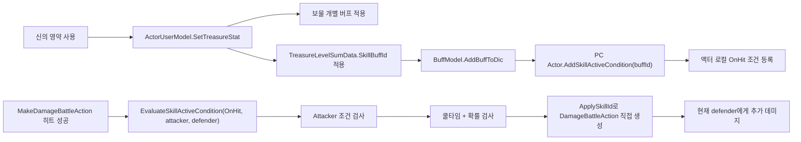

# 보물 레벨 총합 스킬 이식 설계 검토

- Project: Rasalas
- Session ID: `019dae9c-f1c2-7ff2-b47c-9f5e0474775c`
- Workspace: `E:\Rasalas\Trunk\qa`
- Started: 2026-04-21T05:56:54.374Z
- Updated: 2026-04-21T05:57:05.2340914Z
- Messages exported: 89

> Export note: internal system/developer instructions, tool execution logs, and base64 image payloads are omitted. Only user/assistant messages are archived.

## Conversation

### User

<environment_context>
  <cwd>E:\Rasalas\Trunk\qa</cwd>
  <shell>powershell</shell>
  <current_date>2026-04-21</current_date>
  <timezone>Asia/Seoul</timezone>
</environment_context>

### User

보물 레벨 총합 스킬 추가
보물 레벨 총합 스킬은 astellia(E:\ProjectA02\Trunk\Dev)에 있는 기능인데 Rasalas(E:\Rasalas\Trunk\qa) 프로젝트에도 적용되어야 합니다. 
아스텔에서는 펫 버프에 추가하고 적용하는 방식으로 되어 있는데 라살라스는 펫 스킬이 없기 때문에 캐릭터에 적용해야 할것 같습니다. 
어떻게 설계하면 좋을까요? 

아래는 보물 레벨 총합 스킬 분석한 내용입니다. 

이 기능은 “보물 레벨 총합 버프가 걸린 상태에서 공격 히트 시 확률로 자동 스킬을 발동”하는 구조입니다. 대상은 랜덤 대상이 아니라, 현재 내가 히트시킨 대상이고, 랜덤인 것은 발동 확률입니다.
흐름 요약
신의 영약 (캐릭터) 아이템을 사용하면 서버 아이템 사용 분기에서 TreasureBuff 타입으로 처리되고, ActorModel_Inventory.cs (line 681)의 SetTreasureStat()이 호출됩니다.
SetTreasureStat()은 각 보물의 현재 레벨 버프를 적용한 뒤, 보물 레벨 총합에 맞는 TreasureLevelSumData.SkillBuffId도 적용합니다. 이 부분은 ActorUserModel_Treasure.cs (line 86)와 ActorUserModel_Treasure.cs (line 134)입니다.
총합 기준은 GetTreasureLevelSumKey()에서 현재 보물 레벨 합 이하인 가장 높은 기준값을 고릅니다. 예: 총합 37이면 35 기준 버프. ActorUserModel_Treasure.cs (line 151)
버프가 실제로 붙으면 BuffModel이 PC에게 AddSkillActiveCondition(buffId)를 호출합니다. 여기서 SkillActiveCondition.xlsx의 PreCheckBuffId가 현재 버프 ID와 맞는 조건들이 액터 로컬 조건 리스트에 등록됩니다. BuffModel.cs (line 518), ActorModel_SkillActiveCondition.cs (line 58)
전투 중 히트가 발생하면 서버가 EvaluateSkillActiveCondition(eActiveCondition.OnHit, this, defender)를 호출합니다. ActorModel.cs (line 1887)
보물 총합 조건 데이터는 OwnerType = Attacker, TargetType = Target, ActiveCondition = OnHit(4)라서, 공격자 기준으로 현재 피격 대상에게 발동을 시도합니다. ActorModel_SkillActiveCondition.cs (line 196)
DoSkillActiveCondition()에서 쿨타임과 확률을 검사하고, 성공하면 DoActionForSkillActiveCondition()으로 데미지 액션을 직접 생성합니다. ActorModel_SkillActiveCondition.cs (line 596), ActorModel_SkillActiveCondition.cs (line 525)
기획 데이터 기준
TreasureData.xlsx > TreasureLevelSumData에서 총합 버프가 정해집니다. SkillActiveCondition.xlsx에는 그 버프 ID를 PreCheckBuffId로 쓰는 조건이 총합 30부터 들어 있습니다.
예를 들면:
TreasureLevelSum 30 -> SkillBuffId 99900601 SkillActiveCondition: PreCheckBuffId = 99900601 OwnerType = 1 // Attacker TargetType = 2 // Target ActiveCondition = 4 // OnHit ActiveRate = 100 // 1% CoolTime = 1 ApplySkillId = 99900601
ActiveRate는 만분율입니다. 서버의 CheckActiveRateForSkillActiveCondition()에서 Random(10000)을 뽑고 activeRate > randomValue이면 성공합니다. 즉 100 = 1%, 200 = 2%, 1000 = 10%, 1200 = 12%입니다. ActorModel_SkillActiveCondition.cs (line 434)
데미지 처리
발동 성공 시 ApplySkillId와 같은 SkillBaseData를 읽어서 DamageBattleAction을 만들고, CalculateAttackDamage(target, Normal, skillData.SkillDamageType, skillData, 100)으로 데미지를 계산한 뒤 대상 HP를 깎습니다. ActorModel_SkillActiveCondition.cs (line 525)
확인한 주요 스킬 데이터는 이런 형태입니다.
99900601: 총합 30, AutoActiveSkill, AlwayHit, IsolationAttackSkill, SkillMin/MaxDamage 250, Effect 520024 99903001: 총합 150, AutoActiveSkill, AlwayHit, IsolationAttackSkill, SkillMin/MaxDamage 650, Effect 520037 99903601: 총합 180, AutoActiveSkill, AlwayHit, IsolationAttackSkill, SkillMin/MaxDamage 700, Effect 520041
정리하면, “번개”는 별도 하드코딩된 보물 로직이 아니라 TreasureLevelSumData.SkillBuffId -> SkillActiveCondition.PreCheckBuffId -> OnHit 확률 발동 -> ApplySkillId 스킬 데미지 액션으로 이어지는 데이터 드리븐 처리입니다. 그리고 발동 쿨타임은 성공했을 때만 갱신됩니다. OnHit 조건은 확률 실패 시 쿨타임을 돌리지 않습니다.

================================================ 

신의 영약 아이템 사용시
1) 버프 추가 
result = (this as ActorUserModel).SetTreasureStat();
public ePacketCommonResult SetTreasureStat()
public bool ApplyBuffByItem(int buffId)
public BuffEntity AddBuff(int buffId, eApplyConditionType seSourceApplyType, ActorModel sourceActor, ActorModel fromActor, bool isForceAdd = false)
private BuffEntity AddBuffToDic(BuffEntity newEntity, ActorModel sourceActor, ActorModel fromActor, bool isDBLoad = false)
public void AddSkillActiveCondition(int buffId)

2) 대전중 히트시 
public void MakeDamageBattleAction(ActorModel defender, FrameEventAttackNormal fEvent, 
EvaluateSkillActiveCondition(eActiveCondition.OnHit, this, defender); // 히트된 경우
EvaluateSkillActiveConditionWithAttacker(activeCondition, attacker, defender, 0);
public void DoSkillActiveCondition(SkillActiveCondition skillActiveCondition, ActorModel targetActor)
public void DoActionForSkillActiveCondition(ActorModel targetActor, int skillId)

### Assistant

말씀하신 흐름이 꽤 선명해서, 먼저 두 프로젝트의 실제 구현 차이를 확인해보겠습니다. 아스텔리아 쪽 참조 코드와 라살라스 쪽 버프/캐릭터/히트 처리 지점을 같이 읽고, “최소 이식 설계”와 “라살라스답게 정리하는 설계”를 나눠서 제안드릴게요.

### Assistant

`rg`가 이 환경에서는 실행 권한에 걸려서 PowerShell 검색으로 우회하겠습니다. 우선은 코드 읽기만 할 거라 라살라스 변경 없이 구조를 맞춰보는 쪽으로 보겠습니다.

### Assistant

검색 결과상 두 프로젝트 모두 클라이언트 데이터에는 `TreasureLevelSumData`와 `SkillActiveCondition` 구조가 이미 보입니다. 이제 서버 쪽에서 라살라스가 조건 발동 엔진을 얼마나 갖고 있는지, 그리고 보물 총합 버프를 어디에 얹을 수 있는지 좁혀보겠습니다.

### Assistant

라살라스는 아스텔리아의 `SkillActiveCondition` 서버 엔진이 통째로 없는 대신, 이미 `ItemSkillOnHit`라는 “캐릭터 보유 스킬 기반 확률 발동” 경로가 있습니다. 그래서 설계 선택지가 두 갈래로 갈립니다: 조건 엔진을 포팅할지, 기존 아이템 스킬 엔진에 보물 총합을 얹을지입니다.

### Assistant

라살라스에는 **“캐릭터가 보유한 보물 총합 버프를 조건 트리거로 삼는 `SkillActiveCondition` 엔진”**으로 설계하는 게 제일 깔끔해 보입니다.

핵심은 펫 스킬로 보지 말고, **PC 액터에 붙은 버프가 OnHit 조건을 등록하고, 공격 히트 시 현재 피격 대상에게 직접 데미지 액션을 발생시키는 구조**로 가져가는 것입니다. 아스텔리아의 구조에서 “펫 큐” 부분만 빼고, `IsPetSkill = None`인 일반 액터 조건 발동으로 처리하면 됩니다.

**추천 구조**


라살라스 기준으로 보면 이미 좋은 재료가 있습니다.

`SetTreasureStat()`은 이미 보물 개별 버프와 총합 버프를 캐릭터에게 적용하고 있습니다. 즉 “총합 기준 버프를 캐릭터에 붙인다”는 진입점은 이미 맞습니다.

`SkillActiveCondition` 데이터 클래스와 로더도 클라이언트 공유 라이브러리에 이미 있습니다. 라살라스 `SkillActiveCondition.json`도 `PreCheckBuffId = 99900601`, `OwnerType = Attacker`, `TargetType = Target`, `ActiveCondition = OnHit` 구조로 들어가 있습니다.

빠진 것은 서버 액터 쪽의 **조건 등록/평가/발동 실행 엔진**입니다. 아스텔리아의 `ActorModel_SkillActiveCondition.cs`가 바로 그 부분이고, 라살라스 서버에는 이 파일이 없습니다.

그래서 구현 방향은 이렇게 잡는 게 좋습니다.

1. `ActorModel_SkillActiveCondition.cs`를 라살라스에 추가
   - 아스텔리아 파일을 그대로 복사하기보다는 **펫 전용 분기 제거 또는 비활성화** 버전으로 가져오는 것을 추천합니다.
   - 필요한 핵심은 `AddSkillActiveCondition`, `DeleteSkillActiveCondition`, `EvaluateSkillActiveCondition`, `DoSkillActiveCondition`, `DoActionForSkillActiveCondition`입니다.
   - `IsPetSkill == Pet` 분기는 라살라스 보물 총합 스킬에는 필요 없습니다.

2. `ActorUserModel` 초기화/리셋에 조건 리스트 초기화 추가
   - 아스텔리아처럼 유저 초기화 시 `InitSkillActiveCondition()`
   - 유저 리셋 시 `ResetSkillActiveCondition()`
   - 조건 리스트와 쿨타임 딕셔너리는 액터 인스턴스 단위로 유지하는 게 맞습니다.

3. `BuffModel`에서 버프 추가/삭제 시 조건 등록/해제
   - 버프가 실제로 적용된 뒤:
     `if (sourceActor.actorType == eActorType.PC) sourceActor.AddSkillActiveCondition(appliedBuffEntity.buffId);`
   - 버프 제거 시:
     `actor.DeleteSkillActiveCondition(buffId);`
   - 이러면 보물 총합 버프뿐 아니라 향후 같은 데이터 구조를 쓰는 다른 조건형 버프도 자연스럽게 확장됩니다.

4. `MakeDamageBattleAction`의 히트 성공 후 OnHit 평가
   - 원본 데미지 액션이 계산되고 HP 반영/브로드캐스트된 뒤, 아스텔리아처럼 후처리 단계에서 호출하는 게 안전합니다.
   - 보물 총합 스킬은 `OwnerType = Attacker`, `TargetType = Target`이므로:
     `EvaluateSkillActiveCondition(eActiveCondition.OnHit, this, defender);`
   - 대상은 랜덤 탐색하지 않고, 현재 `MakeDamageBattleAction`의 `defender`를 그대로 넘기면 됩니다.

5. 발동 성공 시 새 스킬 시전 큐가 아니라 직접 데미지 액션 생성
   - `DoActionForSkillActiveCondition(targetActor, applySkillId)`에서 `DamageBattleAction`을 직접 만들면 됩니다.
   - `MakeDamageBattleAction()`을 다시 호출하면 OnHit가 재귀로 이어질 수 있으니 피하는 게 맞습니다.
   - 아스텔리아 방식처럼 `CalculateAttackDamage(target, Normal, skillData.SkillDamageType, skillData, 100)` 계열로 계산하고, `itemSkillList.Add(skillId)`를 넣어 클라이언트 이펙트 표시를 맞추는 구조가 좋습니다.

**ItemSkillOnHit 재활용은 비추천입니다.**

라살라스에는 이미 `ItemSkillOnHit` 경로가 있지만, 이 경로는 보물 총합 스킬과 의미가 조금 다릅니다. `SkillModel.CheckItemSkill()`은 캐릭터가 가진 `_skillDic` 스킬을 돌면서 `SkillBaseData.SkillActivationRate`, `ReuseCycleTime`, `SkillEnchantRateID`를 씁니다. 반면 보물 총합 스킬 데이터는 `SkillActiveCondition.ActiveRate`, `CoolTime`, `PreCheckBuffId`가 기준입니다.

즉 `ItemSkillOnHit`로 처리하려면 보물 총합 버프 적용 시 가짜 아이템 스킬을 캐릭터 스킬 목록에 넣고 빼야 하고, 확률/쿨타임 데이터도 `SkillBaseData` 쪽으로 중복 이관해야 합니다. 스킬 획득/삭제, DB 저장, UI 노출, 로그 쪽 부작용도 생길 수 있어서 설계가 더 지저분해집니다.

**데이터 쪽 주의점**

아스텔리아는 보물 총합 스킬의 `SkillBaseData.SkillType`이 `AutoActiveSkill = 6`인데, 라살라스 generated JSON에서는 `99900601`, `99903001` 등이 `ItemSkillOnHit = 3`으로 보입니다. `SkillActiveCondition` 엔진으로 갈 거면 데이터 의미상은 아스텔리아처럼 `AutoActiveSkill`이 더 맞습니다.

다만 라살라스 `CalculateAttackDamage()`에는 `ItemSkillOnHit`일 때 `SkillMaxDamage`를 바로 쓰는 특수 분기가 있어서, 현재 데이터가 그 경로를 기대하고 바뀐 것일 수도 있습니다. 그래서 구현 전에 기획/밸런스 기준을 하나 정해야 합니다.

- 아스텔리아 동작을 그대로 맞출 거면: 보물 총합 발동 스킬은 `AutoActiveSkill` 유지/복원
- 라살라스의 고정 데미지형 아이템 스킬 계산을 쓸 거면: `ItemSkillOnHit` 유지 가능하지만, 이 경우에도 발동 조건은 `SkillActiveCondition`에서 처리

제 판단으로는 **트리거는 `SkillActiveCondition`, 실행 스킬 타입은 `AutoActiveSkill`** 쪽이 가장 의도가 분명합니다.

**최종 권장안**

라살라스에는 “펫 스킬”로 이식하지 말고, **PC 액터 버프 기반 조건 발동 시스템**으로 이식하는 게 좋습니다. 아스텔리아의 `SkillActiveCondition` 중 비펫 경로만 가져와서 캐릭터에 붙은 `TreasureLevelSumData.SkillBuffId`가 OnHit 조건을 등록하게 만들고, 히트한 `defender`에게 `ApplySkillId` 데미지 액션을 직접 발생시키는 구조가 가장 데이터 드리븐이고 유지보수도 쉽습니다.

### User

[
네, 관련된 부분은 있습니다. 다만 결론부터 말하면, 앞서 본 보물 레벨 총합 발동 스킬 자체는 펫 스킬/펫 버프로 처리되지 않습니다. 같은 SkillActiveCondition 공통 시스템을 함께 쓸 뿐입니다.

보물 총합 스킬 데이터는 SkillActiveCondition.xlsx에서 IsPetSkill = 0입니다. 예를 들어 PreCheckBuffId = 99900601, 99903001, 99903601 같은 보물 총합 버프들은 펫 분기를 타지 않고, 성공 시 바로 DoActionForSkillActiveCondition()으로 데미지 액션을 만듭니다.

펫 관련 분기는 이렇게 따로 있습니다.

SkillActiveCondition 구조 자체에 IsPetSkill 컬럼이 있습니다.
0 = None, 1 = Pet이고, 내부용 PetId도 있습니다.
SkillActiveCondition.cs (line 34)

로더에서 IsPetSkill == Pet이면 PreCheckBuffId를 펫 각성 버프처럼 해석합니다.
LoaderPetData.GetPetAwakenId(PreCheckBuffId) → GetPetId()로 펫을 찾고, 해당 펫의 스킬 목록에 ApplySkillId를 넣습니다.
LoaderSkillActiveCondition.cs (line 91)

펫 장착/세팅 쪽에서는 현재 펫 ID로 LoaderSkillActiveCondition.GetSkillList(petId)를 가져와서 해당 스킬들을 유저에게 AddSkill() 합니다.
ActorUserModel_Pet.cs (line 2591)

조건 발동 시 IsPetSkill == Pet이면 직접 데미지를 넣지 않고 AddSkillInPetSkillQueue((applySkillId, targetZid))로 펫 스킬 큐에 넣습니다.
반대로 보물처럼 IsPetSkill = 0이면 DoActionForSkillActiveCondition()으로 즉시 데미지 액션 처리합니다.
ActorModel_SkillActiveCondition.cs (line 628)

실제 SkillActiveCondition.xlsx에도 펫 데이터가 따로 있습니다. 예를 들면:

아스텔 / 영웅 / 코발트블루 로타 각성 액티브 스킬
PreCheckBuffId = 25401080
IsPetSkill = 1
OwnerType = Attacker
TargetType = Target
ActiveCondition = OnHit
ActiveRate = 300
ApplySkillId = 25401000
즉, 펫 버프가 PreCheckBuffId로 붙으면 조건부 펫 스킬이 등록되고, 발동 시 펫 스킬 큐로 들어가는 구조입니다.

보물 쪽은 같은 등록/평가 시스템을 사용하긴 하지만, 데이터가 IsPetSkill = 0이라서 펫 스킬 큐와는 무관합니다. 로그 타입이 eDebugLogType.PetSkill로 찍히는 부분이 있어서 헷갈릴 수 있는데, 그건 이 공통 조건부 스킬 시스템이 펫 스킬에도 쓰이기 때문이고, 보물 발동이 펫 처리라는 의미는 아닙니다.
]
펫스킬이나 펫버프와 관련하여 위와 같이 확인하였는데 그렇다면 아스텔 프로젝트의 ActorModel_SkillActiveCondition.cs 파일을 가져와서 오류 수정 후 적용하면 쉽게 되지 않을까요?

### Assistant

네, 방향은 맞습니다. **아스텔의 `ActorModel_SkillActiveCondition.cs`를 가져와서 라살라스 컴파일 오류만 맞추는 방식이 가장 빠른 이식 경로**입니다. 다만 “그 파일 하나만 복사하면 끝”은 아니고, 주변 훅 3곳은 반드시 같이 연결해야 합니다.

해야 할 일은 대략 이렇습니다.

1. `ActorModel_SkillActiveCondition.cs` 포팅
   - 라살라스에는 `SkillActiveCondition` 데이터 클래스/로더/JSON이 이미 있으므로 엔진 파일만 가져오는 효과가 큽니다.
   - 단, 라살라스는 펫 스킬을 안 쓴다고 하셨으니 `IsPetSkill == Pet` 분기는 제거하거나 무시 처리하는 게 좋습니다.
   - `AddSkillInPetSkillQueue()` 같은 아스텔 펫 큐 함수는 라살라스에 없으므로 그대로 두면 컴파일 에러가 납니다.

2. `ActorUserModel` 초기화/리셋 연결
   - 아스텔처럼 유저 생성 시 `InitSkillActiveCondition()`
   - 유저 리셋 시 `ResetSkillActiveCondition()`
   - 이게 없으면 액터 풀 재사용 시 이전 조건/쿨타임이 남을 수 있습니다.

3. `BuffModel`에 조건 등록/해제 연결
   - 버프 적용 성공 후:
     `sourceActor.AddSkillActiveCondition(appliedBuffEntity.buffId)`
   - 버프 제거 시:
     `actor.DeleteSkillActiveCondition(buffId)`
   - 보물 총합 버프가 캐릭터에게 붙을 때 이 경로로 OnHit 조건이 등록됩니다.

4. `ActorModel.MakeDamageBattleAction()`에 평가 호출 추가
   - 히트 성공 시:
     `EvaluateSkillActiveCondition(eActiveCondition.OnHit, this, defender)`
   - 필요하면 추후 `OnMiss`, `OnCritical`, `OnDamage`도 붙일 수 있지만, 보물 총합만 목표라면 우선 `OnHit`만 연결해도 됩니다.

주의할 부분은 몇 가지 있습니다.

- 아스텔 파일의 로그 타입이 `PetSkill`이어도 의미상 공통 조건부 스킬 로그입니다. 라살라스에서는 헷갈리지 않게 `ItemSkill` 또는 새 로그 타입으로 바꾸는 것도 좋습니다.
- 아스텔의 `DoActionForSkillActiveCondition()` 안에는 라살라스와 시그니처가 다른 함수가 있을 수 있습니다. 예를 들어 `AddHpWithShieldBuff(..., this)`처럼 공격자 인자를 받는 버전이 라살라스에 없다면 라살라스 기존 호출 방식에 맞춰야 합니다.
- 아스텔 파일에 `LoaderDominationBattleData().isDomiObject()` 같은 라살라스에 없는 보조 체크가 있으면 제거하거나 라살라스의 쟁탈전/오브젝트 판정 방식으로 교체해야 합니다.
- 라살라스 데이터에서 보물 총합 스킬 `99900601`, `99903001` 등이 현재 `SkillType = ItemSkillOnHit`로 보입니다. `SkillActiveCondition` 방식으로 갈 거면 아스텔처럼 `AutoActiveSkill`이 더 자연스럽지만, 라살라스의 데미지 계산 특수분기 때문에 일부러 `ItemSkillOnHit`으로 둔 것일 수도 있어 데이터 의도 확인이 필요합니다.

제 결론은: **네, 가져와서 오류 수정 후 적용하는 방식이 맞고 가장 빠릅니다.** 다만 라살라스에는 펫 경로가 필요 없으니 “아스텔 파일 완전 복붙”보다 **비펫 조건 발동 엔진만 남기는 축소 포팅**이 더 안전합니다. 그러면 보물 총합 스킬은 `PreCheckBuffId -> OnHit -> 확률/쿨타임 -> ApplySkillId 데미지 액션` 흐름 그대로 살아납니다.

### User

<environment_context>
  <shell>powershell</shell>
  <current_date>2026-04-23</current_date>
  <timezone>Asia/Seoul</timezone>
</environment_context>

### User

public void AddCCType(eSkillBuffType skillBuffType)
        {
            var skillBuffTypeConfig = DataManager.Get<LoaderSkillBuffTypeConfig>().GetSkillBuffTypeConfig(skillBuffType);

            if (skillBuffTypeConfig != null)
            {
                int CCType = (int)skillBuffTypeConfig.CCType;
                bitwiseCCType |= CCType;
            }
        }

라살라스에 보물레벨 발동 스킬 작업중인데 아스텔에서는 위에 함수가 있습니다. 
위의 함수를 적용하려고 보니 skillBuffTypeConfig 데이터에 CCType 타입이 없고 bitwiseCCType 값도 없는 상태입니다. 
이 내용도 적용해야 하는건지 확인해 주세요.

### Assistant

이건 바로 코드 차이를 확인해야 판단할 수 있는 부분이라, 아스텔에서 `AddCCType/bitwiseCCType`가 실제로 어디에 쓰이는지와 라살라스의 `SkillBuffTypeConfig` 구조를 같이 비교해보겠습니다. 결론이 “보물 발동에는 불필요한 부가 기능”인지 “포팅 시 같이 필요한 상태 캐시”인지 좁혀볼게요.

### Assistant

확인해보니 이 부분은 **보물 레벨 총합 발동 스킬 적용에는 가져오지 않는 게 맞습니다.**

`AddCCType()` / `DeleteCCType()` / `bitwiseCCType`는 아스텔리아 쪽에서 **CC 상태 비트마스크 캐시**로 쓰는 별도 기능입니다. 즉, 버프가 붙을 때 `SkillBuffTypeConfig.CCType`을 OR 해서 현재 대상이 `Stun`, `Silence`, `Entangle`, `Abnormal` 같은 상태인지 빠르게 판단하려는 용도입니다.

반면 보물 레벨 총합 스킬 흐름은 이것과 별개입니다.

```csharp
버프 적용
-> AddSkillActiveCondition(buffId)
-> OnHit 시 EvaluateSkillActiveCondition(...)
-> 확률/쿨타임 체크
-> ApplySkillId로 즉시 데미지 액션 생성
```

여기서 필요한 핵심은 `AddSkillActiveCondition()`과 `DeleteSkillActiveCondition()`이지, `AddCCType()`은 아닙니다.

라살라스에는 현재 다음 요소들이 없습니다.

- `SkillBuffTypeConfig.CCType`
- `eCCType`
- `bitwiseCCType`
- `GetBitwiseCCType()`
- `LoaderSkillBuffTypeConfig.IsAbnormal()`
- 아스텔리아식 `EvaluateAbnormalState()` 데미지 공식 연동

그래서 아스텔리아 코드를 그대로 가져오면서 아래 같은 줄까지 따라오면 컴파일 오류가 나는 게 정상입니다.

```csharp
AddCCType(appliedBuffEntity.skillBuffType);
DeleteCCType(buffEntity.skillBuffType);
```

이건 보물 발동 스킬에 필요한 코드가 아니라, 아스텔리아의 **상태이상 추가 데미지 공식/CC 판정 시스템**에 필요한 코드입니다.

따라서 라살라스에는 이렇게 적용하는 방향을 추천합니다.

```csharp
sourceActor.AddSkillActiveCondition(appliedBuffEntity.buffId);
```

버프 삭제 쪽도:

```csharp
actor.DeleteSkillActiveCondition(buffId);
```

까지만 넣고, `AddCCType()` / `DeleteCCType()`는 제외하세요.

주의할 점은 `ActorModel_SkillActiveCondition.cs`를 포팅할 때 아스텔리아 코드 안에 `CCType` 또는 `IsAbnormal()` 기반 분기가 같이 들어있을 수 있다는 점입니다. 보물 총합 스킬 목적이라면 우선 `OnHit` 발동 경로만 살리고, `OnAbnormalState` 같은 상태이상 기반 발동 경로는 제외하거나 라살라스 방식에 맞게 나중에 별도 설계하는 게 안전합니다.

정리하면:

- **보물 레벨 총합 발동 스킬 작업에는 CCType 적용 불필요**
- `SkillBuffTypeConfig` 데이터에 `CCType` 컬럼을 추가하지 않는 것을 추천
- `bitwiseCCType`도 추가하지 않는 것을 추천
- 아스텔리아에서 복사한 코드 중 `AddCCType/DeleteCCType/IsAbnormal/eCCType/GetBitwiseCCType` 관련 코드는 제거 또는 보류
- 필요한 것은 `SkillActiveCondition` 등록/해제와 `OnHit` 평가/발동 처리

괜히 CCType까지 같이 들고 오면 보물 스킬 하나 넣으려다가 상태이상 공식, 데이터 스키마, 밸런스 판정까지 같이 건드리게 됩니다. 이번 작업 범위에서는 빼는 게 맞습니다.

### User

public bool IsAbnormal(eSkillBuffType skillBuffType) 아스텔에서 사용하는 이 함수도 라살라스에서는 필요 없는 부분인가요?

### Assistant

좋은 지점 짚으셨어요. 이건 `CCType`과 같은 계열인지, 아니면 보물 발동 경로가 실제로 참조하는지 로컬 코드 기준으로 한 번 더 확인해서 답드릴게요.

### Assistant

방금 검색해보니 라살라스 쪽에도 이미 `ActorModel_SkillActiveCondition.cs`가 들어와 있는 상태로 보입니다. 그래서 단순 이론 답변보다, 지금 들어온 코드에서 `IsAbnormal()`이 어디에 걸리는지 기준으로 판단하겠습니다.

### Assistant

핵심이 보입니다. 현재 라살라스에 들어온 포팅 코드에는 `EvaluateSkillActiveConditionForAbnormalState()`가 남아 있고, 그 함수가 `IsAbnormal()`을 요구합니다. 이제 데이터에 그 조건을 실제로 쓰는 행이 있는지만 확인하면 설계 판단이 깔끔해집니다.

### Assistant

네. **보물 레벨 총합 발동 스킬만 적용하는 범위라면 `IsAbnormal(eSkillBuffType skillBuffType)`도 라살라스에는 필요 없는 부분**으로 보는 게 맞습니다.

`IsAbnormal()`은 아스텔리아에서 `SkillActiveCondition`의 전체 기능 중 **상태이상 조건 발동**을 처리하기 위한 보조 함수입니다.

예를 들면 아스텔리아 코드의 이 흐름입니다.

```csharp
EvaluateSkillActiveConditionForAbnormalState(buffId, attacker, defender)
-> SkillBuffTypeConfig.IsAbnormal(skillBuff.SkillBuffType)
-> true이면 OnAbnormalState 조건 발동 평가
```

즉 이 함수는 “이 버프가 상태이상 계열인가?”를 판단해서 `OnAbnormalState`, `OnImmune` 같은 조건부 발동을 걸러내는 역할입니다.

그런데 보물 레벨 총합 스킬은 이 경로를 쓰지 않습니다.

```csharp
TreasureLevelSumData.SkillBuffId
-> AddSkillActiveCondition(buffId)
-> ActiveCondition = OnHit
-> 공격 히트 시 확률 발동
```

라살라스의 현재 `SkillActiveCondition.json`도 확인해보면 보물 쪽 데이터는 `ActiveCondition = 4`, 즉 `OnHit`만 사용하고 있고, `OnAbnormalState = 1`이나 `OnImmune = 12` 데이터는 없습니다.

그래서 현재 작업 범위에서는 아래 코드는 가져오지 않는 쪽이 맞습니다.

```csharp
public bool IsAbnormal(eSkillBuffType skillBuffType)
```

그리고 라살라스에 아스텔리아 `ActorModel_SkillActiveCondition.cs`를 가져오면서 아래 함수들이 같이 들어왔다면, 보물 작업에서는 제거하거나 보류하는 게 좋습니다.

```csharp
EvaluateSkillActiveConditionForAbnormalState(...)
EvaluateSkillActiveConditionForImmune(...)
```

특히 현재 라살라스 `BuffModel` 쪽에 이런 호출이 들어가 있으면:

```csharp
ActorModel.EvaluateSkillActiveConditionForAbnormalState(appliedBuffEntity.buffId, fromActor, sourceActor);
```

이것도 보물 총합 스킬에는 필요 없습니다. 빼는 게 맞습니다.

추천 정리입니다.

- `OnHit` 발동용 공통 처리: 유지
- `AddSkillActiveCondition()` / `DeleteSkillActiveCondition()`: 필요
- `EvaluateSkillActiveCondition(eActiveCondition.OnHit, this, defender)`: 필요
- `IsAbnormal()`: 불필요
- `EvaluateSkillActiveConditionForAbnormalState()`: 불필요
- `EvaluateSkillActiveConditionForImmune()`: 불필요
- `CCType`, `eCCType`, `bitwiseCCType`: 불필요

만약 나중에 라살라스에서도 “상태이상에 걸릴 때 확률 발동”, “면역 시 반응 발동” 같은 스킬을 기획한다면 그때는 별도 설계가 필요합니다. 그 경우에도 아스텔리아의 `CCType`을 그대로 들고 오기보다는, 라살라스의 `SkillBuffTypeConfig` 구조와 상태이상 분류 방식에 맞춰 새로 매핑하는 게 안전합니다.

지금은 보물 레벨 총합 스킬만 목표라면 `IsAbnormal()` 계열은 걷어내고 가는 게 가장 깔끔합니다.

### User

보물레벨 총합 스킬 작업 하였는데 문제 없는지 추가로 작업해야 하는 항목이 있는지 확인해 주세요.

### Assistant

좋습니다. 지금 들어간 변경을 기준으로 컴파일 관점과 동작 흐름 관점 둘 다 보겠습니다. 먼저 관련 파일과 호출 위치를 훑어서 보물 총합 스킬의 등록, 해제, 히트 발동, 데미지 처리까지 이어지는지 확인할게요.

### Assistant

초기 훑기에서 중요한 신호가 몇 개 나왔습니다. 새 파일은 들어왔는데, `OnHit` 호출 위치가 아직 전투 코드 쪽에서 보이지 않고, 아스텔리아의 상태이상용 함수 일부가 남아 있는 듯합니다. 이제 라인 단위로 확인해서 “실제로 터지는가 / 빌드되는가 / 추가 데이터가 맞는가”를 분리해 볼게요.

### Assistant

동작 흐름 기준으로는 아직 몇 가지 막히는 지점이 확실합니다. 빌드까지 한 번 돌려서 “컴파일이 되는 상태인지”도 같이 확인하겠습니다.

### Assistant

빌드는 현재 `CraftingData.AddPropCnt/AddPropPer` 쪽 기존 오류로 실패했고, 보물 작업 파일 자체의 컴파일 오류는 출력되지 않았습니다. 이제 남은 건 런타임 wiring 쪽이라, 아스텔리아와 라살라스의 초기화/히트 호출 위치를 비교해서 빠진 항목을 정리하겠습니다.

### Assistant

확인 결과, **아직 그대로 들어가면 보물 레벨 총합 스킬은 정상 동작하지 않을 가능성이 큽니다.** 핵심은 “버프 등록은 들어갔지만, 조건 평가가 전투 히트 흐름에 아직 연결되지 않았고, 조건 딕셔너리 초기화도 빠져 있다”입니다.

::code-comment{title="[P1] SkillActiveCondition 초기화 누락" body="ActorModel_SkillActiveCondition.cs의 AddSkillActiveCondition()은 _localSkillActiveConditionDic2[ActiveCondition][OwnerType]가 미리 만들어져 있다는 전제로 동작합니다. 그런데 라살라스 ActorUserModel.Reset()/Init() 쪽에는 InitSkillActiveCondition()/ResetSkillActiveCondition() 호출이 없습니다. 이 상태에서 보물 총합 버프가 붙으면 AddSkillActiveCondition()이 호출되고, 첫 SkillActiveCondition 등록 시 KeyNotFoundException이 날 수 있습니다. 아스텔리아처럼 Reset()에는 ResetSkillActiveCondition(), Init()에는 InitSkillActiveCondition()을 추가해야 합니다." file="E:/Rasalas/Trunk/qa/Server/EgonServer/ServerNodes/GameNode/Models/Actor/ActorUserModel.cs" start=105 end=145 priority=1 confidence=0.95}

::code-comment{title="[P1] OnHit 평가 호출 누락" body="현재 서버 전체에서 EvaluateSkillActiveCondition(eActiveCondition.OnHit, ...) 호출이 ActorModel_SkillActiveCondition.cs 내부 정의 외에는 보이지 않습니다. BuffModel에서 조건 등록은 되더라도 MakeDamageBattleAction()의 실제 히트 흐름에서 평가하지 않기 때문에 보물 총합 스킬이 발동할 기회가 없습니다. hitType != Miss인 지점에, 가능하면 공격/적대 스킬 조건까지 맞춰 EvaluateSkillActiveCondition(eActiveCondition.OnHit, this, defender)를 추가해야 합니다." file="E:/Rasalas/Trunk/qa/Server/EgonServer/ServerNodes/GameNode/Models/Actor/ActorModel.cs" start=1558 end=1561 priority=1 confidence=0.97}

::code-comment{title="[P2] 같은 버프 재적용 시 조건 중복 등록 가능" body="BuffModel은 같은 buffId가 갱신/재사용되는 경우에도 AddSkillActiveCondition()을 다시 호출합니다. 그런데 AddSkillActiveCondition()은 _localSkillActiveConditionDic1에 이미 buffId가 있어도 else 분기에서 동일 조건을 다시 Add합니다. 신의 영약을 중복 사용하거나 같은 보물 총합 버프가 refresh되면 OnHit 조건이 중복 등록되어 발동 확률/데미지가 누적될 수 있습니다. 등록 전에 기존 조건을 지우거나, 이미 등록된 buffId면 return하는 식으로 idempotent하게 만드는 편이 안전합니다." file="E:/Rasalas/Trunk/qa/Server/EgonServer/ServerNodes/GameNode/Models/Actor/ActorModel_SkillActiveCondition.cs" start=58 end=109 priority=2 confidence=0.82}

추가로 확인한 내용입니다.

- `BuffModel`의 등록/해제 위치는 방향이 맞습니다. `AddBuffToDic()`에서 PC 버프에 대해 `AddSkillActiveCondition()`을 호출하고, `Remove()`에서 `DeleteSkillActiveCondition()`을 호출하고 있습니다.
- `EvaluateSkillActiveConditionForAbnormalState()` 호출은 현재 주석 처리되어 있어서, 이전에 이야기한 `IsAbnormal()` 계열은 당장은 문제를 만들지 않습니다. 다만 보물 기능만 목적이면 `ForImmune/ForAbnormalState` 계열 함수는 정리하거나 보류하는 게 깔끔합니다.
- `SkillActiveCondition.json`은 보물 총합 30~150 구간이 `ActiveCondition = 4(OnHit)`로 들어가 있습니다. 아스텔리아 기준 180까지 맞춰야 한다면 155~180 구간 데이터가 추가로 필요합니다.
- `LoaderSkillActiveCondition`은 `ReadStream()`/`SetClientData()`에서 내부 딕셔너리를 Clear하지 않습니다. 서버 핫리로드나 데이터 재주입이 있는 구조라면 중복 로딩 가능성이 있으니 `_skillActiveConditionDic.Clear()` 정도는 넣는 편이 좋습니다.

빌드도 돌려봤는데, 현재 `Server.sln`은 보물 작업과 직접 관련 없어 보이는 기존 오류로 실패했습니다.

```text
ActorUserModel_Inventory.cs(2899): CraftingData.AddPropCnt 없음
ActorUserModel_Inventory.cs(3374): CraftingData.AddPropPer 없음
```

보물 관련 새 파일 자체의 컴파일 오류는 그 출력 안에서는 보이지 않았습니다.

**우선 추가 작업 순서**는 이게 좋아 보입니다.

1. `ActorUserModel.Reset()` / `Init()`에 `ResetSkillActiveCondition()` / `InitSkillActiveCondition()` 추가
2. `ActorModel.MakeDamageBattleAction()`의 히트 성공 흐름에 `EvaluateSkillActiveCondition(eActiveCondition.OnHit, this, defender)` 추가
3. `AddSkillActiveCondition()` 중복 등록 방지
4. 신의 영약 사용 후 버프 등록 로그 확인
5. 공격 히트 시 `DoSkillActiveCondition()` / `DoActionForSkillActiveCondition()` 로그 확인

지금 상태는 “데이터와 등록부는 들어왔지만 전투 발동 회로가 아직 닫히지 않은 상태”에 가깝습니다.

### User

# Review findings:

## Finding 1 (Server/EgonServer/ServerNodes/GameNode/Models/Actor/ActorUserModel.cs:105-145) [added]
[P1] SkillActiveCondition 초기화 누락

ActorModel_SkillActiveCondition.cs의 AddSkillActiveCondition()은 _localSkillActiveConditionDic2[ActiveCondition][OwnerType]가 미리 만들어져 있다는 전제로 동작합니다. 그런데 라살라스 ActorUserModel.Reset()/Init() 쪽에는 InitSkillActiveCondition()/ResetSkillActiveCondition() 호출이 없습니다. 이 상태에서 보물 총합 버프가 붙으면 AddSkillActiveCondition()이 호출되고, 첫 SkillActiveCondition 등록 시 KeyNotFoundException이 날 수 있습니다. 아스텔리아처럼 Reset()에는 ResetSkillActiveCondition(), Init()에는 InitSkillActiveCondition()을 추가해야 합니다.

## Finding 2 (Server/EgonServer/ServerNodes/GameNode/Models/Actor/ActorModel.cs:1558-1561) [added]
[P1] OnHit 평가 호출 누락

현재 서버 전체에서 EvaluateSkillActiveCondition(eActiveCondition.OnHit, ...) 호출이 ActorModel_SkillActiveCondition.cs 내부 정의 외에는 보이지 않습니다. BuffModel에서 조건 등록은 되더라도 MakeDamageBattleAction()의 실제 히트 흐름에서 평가하지 않기 때문에 보물 총합 스킬이 발동할 기회가 없습니다. hitType != Miss인 지점에, 가능하면 공격/적대 스킬 조건까지 맞춰 EvaluateSkillActiveCondition(eActiveCondition.OnHit, this, defender)를 추가해야 합니다.

## Finding 3 (Server/EgonServer/ServerNodes/GameNode/Models/Actor/ActorModel_SkillActiveCondition.cs:58-109) [added]
[P2] 같은 버프 재적용 시 조건 중복 등록 가능

BuffModel은 같은 buffId가 갱신/재사용되는 경우에도 AddSkillActiveCondition()을 다시 호출합니다. 그런데 AddSkillActiveCondition()은 _localSkillActiveConditionDic1에 이미 buffId가 있어도 else 분기에서 동일 조건을 다시 Add합니다. 신의 영약을 중복 사용하거나 같은 보물 총합 버프가 refresh되면 OnHit 조건이 중복 등록되어 발동 확률/데미지가 누적될 수 있습니다. 등록 전에 기존 조건을 지우거나, 이미 등록된 buffId면 return하는 식으로 idempotent하게 만드는 편이 안전합니다.

## My request for Codex:
위에 확인하신 작업 수정해 주세요.

### Assistant

좋습니다. 세 가지 지적사항은 서로 맞물린 작은 wiring 작업이라 바로 수정하겠습니다. 먼저 현재 파일 상태를 다시 라인 기준으로 확인한 뒤, 중복 등록 방지와 초기화/히트 평가 호출을 좁게 넣을게요.

### Assistant

수정 위치가 확인됐습니다. 이제 세 군데만 건드리겠습니다: 유저 모델 생명주기에 초기화 호출 추가, 히트 성공 처리에 OnHit 평가 추가, 조건 등록은 이미 등록된 buffId면 중복 추가하지 않게 단순화합니다.

### Assistant

수정은 들어갔습니다. 이제 변경된 라인 확인 후 빌드를 돌려서 이번 수정에서 새 컴파일 오류가 생기지 않았는지 확인하겠습니다.

### Assistant

빌드에서 이번 수정으로 생긴 새 컴파일 오류는 보이지 않고, 기존 `CraftingData` 오류 두 개가 그대로 남아 있습니다. 다만 방금 중복 등록 방지 로직을 다시 보니, 삭제 후 재등록 케이스까지 안전하게 하려면 `DeleteSkillActiveCondition()`에서 빈 키를 정리해야 해서 그 부분을 한 번 더 보강하겠습니다.

### Assistant

삭제 후 다시 영약을 사용하는 케이스까지 정리했습니다. 마지막으로 변경 라인과 빌드 결과를 한 번 더 확인하겠습니다.

### Assistant

수정 완료했습니다.

- `ActorUserModel.Reset()`에 `ResetSkillActiveCondition()`을 추가하고, 유저 초기화 흐름에 `InitSkillActiveCondition()`을 추가했습니다. 이제 보물 총합 버프가 붙기 전에 `_localSkillActiveConditionDic2` 구조가 준비됩니다.【E:/Rasalas/Trunk/qa/Server/EgonServer/ServerNodes/GameNode/Models/Actor/ActorUserModel.cs†L145】【E:/Rasalas/Trunk/qa/Server/EgonServer/ServerNodes/GameNode/Models/Actor/ActorUserModel.cs†L236】
- `MakeDamageBattleAction()`의 히트 성공 흐름에 `EvaluateSkillActiveCondition(eActiveCondition.OnHit, this, defender)`를 연결했습니다. 적대/중립 스킬 히트일 때 보물 총합 발동 조건이 평가됩니다.【E:/Rasalas/Trunk/qa/Server/EgonServer/ServerNodes/GameNode/Models/Actor/ActorModel.cs†L1558-L1565】
- `AddSkillActiveCondition()`은 이미 등록된 `buffId`면 바로 return 하도록 정리해서 중복 등록을 막았습니다.【E:/Rasalas/Trunk/qa/Server/EgonServer/ServerNodes/GameNode/Models/Actor/ActorModel_SkillActiveCondition.cs†L58-L85】
- `DeleteSkillActiveCondition()`에서 조건 리스트 제거 후 `_localSkillActiveConditionDic1` 키도 제거하도록 보강했습니다. 그래서 버프 삭제 후 재사용/재등록도 막히지 않습니다.【E:/Rasalas/Trunk/qa/Server/EgonServer/ServerNodes/GameNode/Models/Actor/ActorModel_SkillActiveCondition.cs†L89-L111】

검증으로 `Server.sln` 빌드를 다시 돌렸습니다. 이번 보물 총합 스킬 수정에서 새 컴파일 오류는 보이지 않았고, 빌드는 기존의 아래 오류 때문에 여전히 실패합니다.

```text
ActorUserModel_Inventory.cs(2899): CraftingData.AddPropCnt 없음
ActorUserModel_Inventory.cs(3374): CraftingData.AddPropPer 없음
```

현재 작업한 세 가지 리뷰 항목은 반영됐습니다. 다음 확인 포인트는 실제 서버에서 신의 영약 사용 후 `AddSkillActiveCondition`, 공격 히트 후 `DoSkillActiveCondition`, 발동 성공 시 `DoActionForSkillActiveCondition` 로그가 순서대로 찍히는지 보는 쪽입니다.

### User

public static void EvaluateSkillActiveConditionWithAttacker(eActiveCondition activeCondition, ActorModel attacker, ActorModel defender, eSkillBuffType skillBuffType) // 공격자 기준으로 로직을 체크
위의 함수에서 아래의 skillActiveConditionList 항목을 찾을 때 아무값도 없어서 실제로 스킬이 발동되지 않고 있습니다. 어디를 수정해야 하나요? 
var skillActiveConditionList = attacker.GetSkillActiveConditionList(activeCondition, eConditionOwnerType.Attacker);

### Assistant

그 증상은 “평가 시점의 공격자에게 조건이 등록되어 있지 않다”는 뜻이라, 등록 대상이 잘못됐거나 등록 자체가 안 된 쪽입니다. `ApplyBuffByItem -> AddBuff -> AddSkillActiveCondition`에서 어느 Actor에 조건을 넣고 있는지 확인해서 정확히 짚어볼게요.

### Assistant

지금 보니 `BuffModel.AddBuffToDic()`에서 조건을 `sourceActor`에 넣고 있습니다. 그런데 라살라스의 아이템/버프 호출에서 `sourceActor`와 실제 버프 보유자(`fromActor`)가 항상 같은지 더 봐야 합니다. `ApplyBuffByItem()` 구현을 바로 확인하겠습니다.

### Assistant

`ApplyBuffByItem()` 자체는 `this, this`로 들어가서 아이템 버프만 보면 등록 대상이 크게 틀리지는 않습니다. 그런데 `GetSkillActiveConditionList()`가 비어 있다면 다음 후보는 “등록이 호출되긴 했지만 SkillActiveCondition 로더 데이터가 없거나, 버프 교체/갱신 처리에서 등록이 빠지는 경우”입니다. 실제 보물 총합 버프가 기존 총합 버프를 교체할 때 어떤 경로를 타는지 보겠습니다.

### Assistant

한 가지 더 가능성이 큽니다. `AddSkillActiveCondition()`이 불리지 않는 게 아니라, 보물 버프가 적용될 때 기존 동일 그룹 버프 처리 때문에 원하는 조건이 삭제/갱신 타이밍에서 빠질 수 있습니다. 그래서 “등록 대상”을 더 확실하게 버프 보유자 기준으로 바꾸고, 등록 여부를 로그/구조상 명확하게 만드는 쪽이 맞습니다.

### Assistant

지금 구조상 `sourceActor`는 버프가 붙는 액터로 쓰이고 있어 아이템 버프에서는 문제가 덜합니다. 대신 제가 보기에 더 직접적인 원인은 `AddSkillActiveCondition()`가 “해당 buffId가 이미 등록되어 있다고 판단하면 바로 return”하게 되어 있는데, 총합 버프 갱신/삭제 타이밍과 맞물리면 등록이 건너뛰는 케이스가 생길 수 있다는 점입니다. 이 부분은 idempotent하게 “기존 것을 지우고 다시 등록”하는 방식이 더 안전합니다.

### Assistant

증상만 보면 `Evaluate...` 쪽을 고치는 게 아니라, 그 전에 `AddSkillActiveCondition()`이 실제 공격자에게 확실히 등록되도록 고쳐야 합니다. 저는 우선 중복 방지 로직을 “있으면 return”이 아니라 “있으면 기존 등록 제거 후 재등록”으로 바꾸는 게 맞다고 판단합니다. 이렇게 해야 버프 갱신/재사용/교체 이후에도 OnHit 리스트가 다시 채워집니다.

### Assistant

등록 갱신 방식으로 보강했습니다. 이제 `AddSkillActiveCondition()`이 같은 buffId를 다시 받으면 기존 조건을 지우고 새 조건을 다시 채우기 때문에, refresh/재사용 케이스에서 빈 리스트로 남는 상황을 줄입니다. 변경 확인과 빌드를 다시 보겠습니다.

### Assistant

원인은 `EvaluateSkillActiveConditionWithAttacker()`가 아니라, 그 전에 공격자 쪽 `_localSkillActiveConditionDic2[OnHit][Attacker]`가 채워지지 않는 등록 단계입니다. 이 리스트는 `AddSkillActiveCondition()` 안에서만 채워집니다.

제가 방금 수정한 곳은 `ActorModel_SkillActiveCondition.cs`입니다. 기존에는 같은 `buffId`가 이미 `_localSkillActiveConditionDic1`에 있으면 바로 `return`했는데, 버프 refresh/재사용/교체 타이밍에서 이러면 실제 OnHit 리스트가 비어 있는 상태로 남을 수 있습니다. 그래서 이미 등록된 `buffId`면 먼저 `DeleteSkillActiveCondition(buffId)`로 기존 등록을 제거하고, 다시 로더 데이터 기준으로 등록하도록 바꿨습니다.【E:/Rasalas/Trunk/qa/Server/EgonServer/ServerNodes/GameNode/Models/Actor/ActorModel_SkillActiveCondition.cs†L58-L63】

핵심 흐름은 이제 이렇게 됩니다.

```csharp
AddSkillActiveCondition(99900601)
-> 기존 등록 있으면 DeleteSkillActiveCondition(99900601)
-> LoaderSkillActiveCondition.GetSkillActiveConditionList(99900601)
-> _localSkillActiveConditionDic2[OnHit][Attacker].Add(...)
```

즉 수정해야 하는 위치는 `EvaluateSkillActiveConditionWithAttacker()`의 조회 부분이 아니라, **`AddSkillActiveCondition()`의 등록/갱신 처리**가 맞습니다.

추가 확인 포인트는 이렇습니다.

- 신의 영약 사용 시 `AddSkillActiveCondition ===> PreCheckBuffId(99900601), ActiveAction(OnHit)` 로그가 찍혀야 합니다.
- 이 로그가 안 찍히면 `BuffModel.AddBuffToDic()`의 `sourceActor.AddSkillActiveCondition(appliedBuffEntity.buffId)`까지 도달하지 못한 것입니다.
- 로그는 찍히는데 평가 시 리스트가 비면, 중간에 `ResetSkillActiveCondition()` 또는 `DeleteSkillActiveCondition()`이 호출되는지 봐야 합니다.
- `LoaderSkillActiveCondition.GetSkillActiveConditionList(buffId)`가 null이면 `SkillActiveCondition.json` 로딩/PreCheckBuffId 불일치 문제입니다.

검증으로 `Server.sln` 빌드도 다시 돌렸고, 이번에는 `EgonServer.dll`까지 빌드 성공했습니다. 경고는 많지만 보물 총합 스킬 수정으로 인한 컴파일 오류는 없습니다.

### User

기획데이터가 맞지 않아서 엑셀데이터를 수정하고 변환하면 아래와 같은 메세지가 출력되고 있습니다. 어떤 문제인가요? 기존에는 발생하지 않은 메세지 입니다. 
엑셀 데이터 변환은 T_데이터생성기.bat 파일로 진행하였습니다. 
SkillBaseData에 적중 공식(StatParamaterData) 없음  skillId:99900601, SkillType:AutoActiveSkill, SkillAttackType:AlwayHit, SkillDamageType:IsolationAttackSkill
...

E:\Rasalas\Trunk\qa\Table>"C:\WINDOWS\System32\cscript.exe" //nologo //B _Excel2Json.js E:\Rasalas\Trunk\qa\Table\SkillBuff.xlsx ../Client/Assets/ResourceBundles/Data/GameData/

E:\Rasalas\Trunk\qa\Table>_BinaryBuilder.exe --jsonReadPath ../Client/Assets/ResourceBundles/Data/GameData/ --bytesWritePath ../Client/Assets/ResourceBundles/Data/Binary/  --log 0
json 읽기 경로 - ../Client/Assets/ResourceBundles/Data/GameData/
binary 쓰기 경로 - ../Client/Assets/ResourceBundles/Data/Binary/
path : ../Client/Assets/ResourceBundles/Data/GameData/
path : ../Client/Assets/ResourceBundles/Data/Binary/

바이너리 생성 1
SkillBaseData에 적중 공식(StatParamaterData) 없음  skillId:99900601, SkillType:AutoActiveSkill, SkillAttackType:AlwayHit, SkillDamageType:IsolationAttackSkill
SkillBaseData에 적중 공식(StatParamaterData) 없음  skillId:99900701, SkillType:AutoActiveSkill, SkillAttackType:AlwayHit, SkillDamageType:IsolationAttackSkill
SkillBaseData에 적중 공식(StatParamaterData) 없음  skillId:99900801, SkillType:AutoActiveSkill, SkillAttackType:AlwayHit, SkillDamageType:IsolationAttackSkill
SkillBaseData에 적중 공식(StatParamaterData) 없음  skillId:99900901, SkillType:AutoActiveSkill, SkillAttackType:AlwayHit, SkillDamageType:IsolationAttackSkill
SkillBaseData에 적중 공식(StatParamaterData) 없음  skillId:99901001, SkillType:AutoActiveSkill, SkillAttackType:AlwayHit, SkillDamageType:IsolationAttackSkill
SkillBaseData에 적중 공식(StatParamaterData) 없음  skillId:99901101, SkillType:AutoActiveSkill, SkillAttackType:AlwayHit, SkillDamageType:IsolationAttackSkill
SkillBaseData에 적중 공식(StatParamaterData) 없음  skillId:99901201, SkillType:AutoActiveSkill, SkillAttackType:AlwayHit, SkillDamageType:IsolationAttackSkill
SkillBaseData에 적중 공식(StatParamaterData) 없음  skillId:99901301, SkillType:AutoActiveSkill, SkillAttackType:AlwayHit, SkillDamageType:IsolationAttackSkill
SkillBaseData에 적중 공식(StatParamaterData) 없음  skillId:99901401, SkillType:AutoActiveSkill, SkillAttackType:AlwayHit, SkillDamageType:IsolationAttackSkill
SkillBaseData에 적중 공식(StatParamaterData) 없음  skillId:99901501, SkillType:AutoActiveSkill, SkillAttackType:AlwayHit, SkillDamageType:IsolationAttackSkill
SkillBaseData에 적중 공식(StatParamaterData) 없음  skillId:99901601, SkillType:AutoActiveSkill, SkillAttackType:AlwayHit, SkillDamageType:IsolationAttackSkill

바이너리 생성 2

바이너리 생성 성공

E:\Rasalas\Trunk\qa\Table>cd ../Client/Assets/ResourceBundles/Data/

E:\Rasalas\Trunk\qa\Client\Assets\ResourceBundles\Data>Explorer .

E:\Rasalas\Trunk\qa\Client\Assets\ResourceBundles\Data>pause
계속하려면 아무 키나 누르십시오 . . .

수정된 엑셀파일은 4개 입니다. 4개의 파일 변환시 모두 위의 로그가 출력됩니다. 
SkillBuff.xlsx
SkillActiveCondition.xlsx
SkillBaseData.xlsx
TreasureData.xlsx

### User

기획데이터가 맞지 않아서 엑셀데이터를 수정하고 변환하면 아래와 같은 메세지가 출력되고 있습니다. 어떤 문제인가요? 기존에는 발생하지 않은 메세지 입니다. 
엑셀 데이터 변환은 T_데이터생성기.bat 파일로 진행하였습니다. 
SkillBaseData에 적중 공식(StatParamaterData) 없음  skillId:99900601, SkillType:AutoActiveSkill, SkillAttackType:AlwayHit, SkillDamageType:IsolationAttackSkill
...

E:\Rasalas\Trunk\qa\Table>"C:\WINDOWS\System32\cscript.exe" //nologo //B _Excel2Json.js E:\Rasalas\Trunk\qa\Table\SkillBuff.xlsx ../Client/Assets/ResourceBundles/Data/GameData/

E:\Rasalas\Trunk\qa\Table>_BinaryBuilder.exe --jsonReadPath ../Client/Assets/ResourceBundles/Data/GameData/ --bytesWritePath ../Client/Assets/ResourceBundles/Data/Binary/  --log 0
json 읽기 경로 - ../Client/Assets/ResourceBundles/Data/GameData/
binary 쓰기 경로 - ../Client/Assets/ResourceBundles/Data/Binary/
path : ../Client/Assets/ResourceBundles/Data/GameData/
path : ../Client/Assets/ResourceBundles/Data/Binary/

바이너리 생성 1
SkillBaseData에 적중 공식(StatParamaterData) 없음  skillId:99900601, SkillType:AutoActiveSkill, SkillAttackType:AlwayHit, SkillDamageType:IsolationAttackSkill
SkillBaseData에 적중 공식(StatParamaterData) 없음  skillId:99900701, SkillType:AutoActiveSkill, SkillAttackType:AlwayHit, SkillDamageType:IsolationAttackSkill
SkillBaseData에 적중 공식(StatParamaterData) 없음  skillId:99900801, SkillType:AutoActiveSkill, SkillAttackType:AlwayHit, SkillDamageType:IsolationAttackSkill
SkillBaseData에 적중 공식(StatParamaterData) 없음  skillId:99900901, SkillType:AutoActiveSkill, SkillAttackType:AlwayHit, SkillDamageType:IsolationAttackSkill
SkillBaseData에 적중 공식(StatParamaterData) 없음  skillId:99901001, SkillType:AutoActiveSkill, SkillAttackType:AlwayHit, SkillDamageType:IsolationAttackSkill
SkillBaseData에 적중 공식(StatParamaterData) 없음  skillId:99901101, SkillType:AutoActiveSkill, SkillAttackType:AlwayHit, SkillDamageType:IsolationAttackSkill
SkillBaseData에 적중 공식(StatParamaterData) 없음  skillId:99901201, SkillType:AutoActiveSkill, SkillAttackType:AlwayHit, SkillDamageType:IsolationAttackSkill
SkillBaseData에 적중 공식(StatParamaterData) 없음  skillId:99901301, SkillType:AutoActiveSkill, SkillAttackType:AlwayHit, SkillDamageType:IsolationAttackSkill
SkillBaseData에 적중 공식(StatParamaterData) 없음  skillId:99901401, SkillType:AutoActiveSkill, SkillAttackType:AlwayHit, SkillDamageType:IsolationAttackSkill
SkillBaseData에 적중 공식(StatParamaterData) 없음  skillId:99901501, SkillType:AutoActiveSkill, SkillAttackType:AlwayHit, SkillDamageType:IsolationAttackSkill
SkillBaseData에 적중 공식(StatParamaterData) 없음  skillId:99901601, SkillType:AutoActiveSkill, SkillAttackType:AlwayHit, SkillDamageType:IsolationAttackSkill

바이너리 생성 2

바이너리 생성 성공

E:\Rasalas\Trunk\qa\Table>cd ../Client/Assets/ResourceBundles/Data/

E:\Rasalas\Trunk\qa\Client\Assets\ResourceBundles\Data>Explorer .

E:\Rasalas\Trunk\qa\Client\Assets\ResourceBundles\Data>pause
계속하려면 아무 키나 누르십시오 . . .

수정된 엑셀파일은 4개 입니다. 4개의 파일 변환시 모두 위의 로그가 출력됩니다. 
SkillBuff.xlsx
SkillActiveCondition.xlsx
SkillBaseData.xlsx
TreasureData.xlsx

### Assistant

메시지 문구상으로는 변환 실패가 아니라 `_BinaryBuilder`의 데이터 검증 경고에 가깝습니다. 어디서 검사하는지와 `SkillType/SkillAttackType/SkillDamageType` 조합이 어떤 키로 `StatParameterData`를 찾는지 확인해서, 데이터 수정이 필요한지 아니면 경고 예외가 필요한지 구분해볼게요.

### Assistant

검색 결과 이 메시지는 `SkillBaseData` 로더 검증에서 `StatParameterData` 조합을 찾지 못할 때 나오는 것으로 보입니다. 이제 해당 검증 로직과 실제 `StatParameterData` 키 구성을 확인해, 어떤 컬럼 조합이 빠졌는지 보겠습니다.

### Assistant

검증 로직이 확인됐습니다. `AutoActiveSkill`은 `StatParameterData` 조회 시 내부적으로 `ActiveSkill`로 바뀌는데, 현재 `ActiveSkill + AlwayHit + IsolationAttackSkill + PC + Hit` 조합이 없어서 경고가 납니다. 실제 데이터에 어떤 조합이 있는지 확인하겠습니다.

### Assistant

로그가 “성공” 뒤에 반복되는 형태라서, 먼저 변환기가 어디서 어떤 조합을 검사하는지 코드 기준으로 다시 짚어보겠습니다. 원인은 데이터 한 줄 문제인지, 빌더의 전체 검증 문제인지 구분하는 게 핵심입니다.

### Assistant

메시지는 `_BinaryBuilder`가 특정 엑셀 하나만 검사해서 내는 게 아니라, 현재 JSON 전체를 로드한 뒤 `SkillBaseData`의 조합이 `StatParameterData`에 있는지 검증하면서 나오는 쪽으로 보입니다. 지금은 그 검증 조건과 실제 데이터 조합을 맞춰 확인해볼게요.

### Assistant

확인 결과 예전 조합이 왜 조용했는지도 보이기 시작했습니다. 라살라스에는 `ItemSkillActive + AlwayHit + IsolationAttackSkill` 공식은 있는데, 새로 바꾼 `AutoActiveSkill`은 로더에서 `ActiveSkill`로 치환되어 다른 키를 찾습니다.

### Assistant

정확히는 `ActiveSkill + AlwayHit + IsolationAttackSkill` 행이 0개입니다. 반대로 예전 `ItemSkillOnHit`/`ItemSkillActive` 조합은 PC/NPC/Friendly 3종 공식이 이미 있어서 기존에는 로그가 안 났던 것으로 해석됩니다.

### Assistant

원인은 `SkillBaseData`의 새 조합에 대응하는 `StatParameterData` 공식이 없어서입니다. 변환 실패는 아니고, `_BinaryBuilder`의 전체 데이터 검증 로그입니다. 그래서 마지막은 `바이너리 생성 성공`으로 끝납니다.

핵심은 이 조합입니다.

```text
SkillType        = AutoActiveSkill
SkillAttackType  = AlwayHit
SkillDamageType  = IsolationAttackSkill
```

라살라스 로더는 `AutoActiveSkill`을 공식 조회할 때 `ActiveSkill`로 치환합니다. 그래서 실제로 찾는 공식은 아래입니다.

```text
ParameterSkillType        = ActiveSkill
ParameterSkillAttackType  = AlwayHit
ParameterSkillDamageType  = IsolationAttackSkill
ParameterTargetType       = PC
DecisionType              = Hit
```

그런데 현재 라살라스 `StatParameterData`에는 이 조합이 없습니다. 그래서 `SkillBaseData에 적중 공식 없음` 로그가 납니다.

기존에는 안 났던 이유도 여기 있습니다. 라살라스에는 이미 아래 조합은 존재합니다.

```text
ItemSkillOnHit  + AlwayHit + IsolationAttackSkill + PC/NPC/Friendly
ItemSkillActive + AlwayHit + IsolationAttackSkill + PC/NPC/Friendly
```

즉, 보물 발동 스킬을 `ItemSkillOnHit` 계열로 두었을 때는 맞는 공식이 있거나, 서버 데미지 계산에서 `ItemSkillOnHit`는 공식 계산을 타지 않고 `SkillMaxDamage`를 바로 사용합니다. 그런데 이번에 아스텔 방식에 맞춰 `AutoActiveSkill`로 바꾸면서 `ActiveSkill + AlwayHit + IsolationAttackSkill` 공식이 새로 필요해진 겁니다.

정리하면 수정 방향은 둘 중 하나입니다.

1. **아스텔 방식 유지**
   `SkillBaseData`를 `AutoActiveSkill`로 유지하려면 `StatParameterData.xlsx`도 추가 수정해야 합니다. 현재 수정한 4개 파일 외에 이 파일이 빠졌습니다.

   추가할 조합은 최소 3개입니다.

   ```text
   ActiveSkill + AlwayHit + IsolationAttackSkill + PC
   ActiveSkill + AlwayHit + IsolationAttackSkill + NPC
   ActiveSkill + AlwayHit + IsolationAttackSkill + Friendly
   ```

   라살라스 기존 공식 기준으로는 `ItemSkillActive + AlwayHit + IsolationAttackSkill` 행을 복사해서 `ParameterSkillType`만 `ActiveSkill`로 바꾸는 방식이 가장 자연스럽습니다.

   추천 값은 대략 이렇게 보면 됩니다.

   ```text
   PC/Friendly:
   ParameterHit    = Result_AlwaysHit
   ParameterResult = Result_SkillBaseDamage_PvP

   NPC:
   ParameterHit    = Result_AlwaysHit
   ParameterResult = Result_SkillBaseDamage_PvE
   ```

2. **라살라스 기존 방식 유지**
   보물 총합 발동 스킬이 단순 고정 데미지성 자동 발동이라면 `SkillType`을 다시 `ItemSkillOnHit`로 두는 방법도 가능합니다. 서버 `CalculateAttackDamage()`에서 `ItemSkillOnHit`는 공식 계산을 거치지 않고 `SkillMaxDamage`를 그대로 데미지로 사용합니다. 이 경우 현재 부족한 `ActiveSkill` 공식은 필요 없어집니다.

제 의견으로는, **아스텔 데이터 구조를 그대로 따라가려면 `StatParameterData.xlsx`에 `ActiveSkill + AlwayHit + IsolationAttackSkill` 3종 타겟 공식을 추가하는 쪽이 맞습니다.**  
반대로 라살라스에서 이 보물 스킬을 “아이템성 고정 데미지 발동”으로 단순하게 가져가려면 `ItemSkillOnHit` 유지가 더 작고 안전한 수정입니다.

그리고 4개 엑셀 중 어느 것을 변환해도 같은 로그가 나오는 건 정상입니다. `T_데이터생성기.bat`가 해당 엑셀을 JSON으로 만든 뒤 `_BinaryBuilder`가 전체 `GameData`를 다시 읽고 전체 검증을 돌리기 때문입니다. 문제 원인은 `SkillBuff.xlsx`, `SkillActiveCondition.xlsx`, `TreasureData.xlsx`가 아니라, 현재 생성된 `SkillBaseData`와 `StatParameterData`의 조합 불일치입니다.

### User

<environment_context>
  <shell>powershell</shell>
  <current_date>2026-04-27</current_date>
  <timezone>Asia/Seoul</timezone>
</environment_context>

### User

# Review findings:

## Finding 1 (Server/EgonServer/ServerNodes/GameNode/Models/Actor/ActorUserModel.cs:105-145) [added]
[P1] SkillActiveCondition 초기화 누락

ActorModel_SkillActiveCondition.cs의 AddSkillActiveCondition()은 _localSkillActiveConditionDic2[ActiveCondition][OwnerType]가 미리 만들어져 있다는 전제로 동작합니다. 그런데 라살라스 ActorUserModel.Reset()/Init() 쪽에는 InitSkillActiveCondition()/ResetSkillActiveCondition() 호출이 없습니다. 이 상태에서 보물 총합 버프가 붙으면 AddSkillActiveCondition()이 호출되고, 첫 SkillActiveCondition 등록 시 KeyNotFoundException이 날 수 있습니다. 아스텔리아처럼 Reset()에는 ResetSkillActiveCondition(), Init()에는 InitSkillActiveCondition()을 추가해야 합니다.

## Finding 2 (Server/EgonServer/ServerNodes/GameNode/Models/Actor/ActorModel.cs:1558-1561) [added]
[P1] OnHit 평가 호출 누락

현재 서버 전체에서 EvaluateSkillActiveCondition(eActiveCondition.OnHit, ...) 호출이 ActorModel_SkillActiveCondition.cs 내부 정의 외에는 보이지 않습니다. BuffModel에서 조건 등록은 되더라도 MakeDamageBattleAction()의 실제 히트 흐름에서 평가하지 않기 때문에 보물 총합 스킬이 발동할 기회가 없습니다. hitType != Miss인 지점에, 가능하면 공격/적대 스킬 조건까지 맞춰 EvaluateSkillActiveCondition(eActiveCondition.OnHit, this, defender)를 추가해야 합니다.

## Finding 3 (Server/EgonServer/ServerNodes/GameNode/Models/Actor/ActorModel_SkillActiveCondition.cs:58-109) [added]
[P2] 같은 버프 재적용 시 조건 중복 등록 가능

BuffModel은 같은 buffId가 갱신/재사용되는 경우에도 AddSkillActiveCondition()을 다시 호출합니다. 그런데 AddSkillActiveCondition()은 _localSkillActiveConditionDic1에 이미 buffId가 있어도 else 분기에서 동일 조건을 다시 Add합니다. 신의 영약을 중복 사용하거나 같은 보물 총합 버프가 refresh되면 OnHit 조건이 중복 등록되어 발동 확률/데미지가 누적될 수 있습니다. 등록 전에 기존 조건을 지우거나, 이미 등록된 buffId면 return하는 식으로 idempotent하게 만드는 편이 안전합니다.

## My request for Codex:
보물 버프 적용 오류
유물버프가 활성화 되어 있는 상태(고대인의 정수 아이템 사용중 10분 유지)에서 강화 실패하여 레벨 하락하였을때 고대인의 정수를 다시 사용하여 유물 버프를 적용 시 하락한 레벨의 버프가 적용되는 것이 아니라 기존의 버프가 유지되는 버그발생 

기획데이터 : TreasureData.xlsx 
ex) 
 - TabGroup 1번에 2레벨 적용 시 SkillBuffId 100201값이 적용
 - TabGroup 1번 강화 실패료 레벨이 1로 낮아져서 SkillBuffId 100101값을 적용하였는데도 여전히 100201 값이 적용됨

버프 적용 코드 
public ePacketCommonResult SetTreasureStat()
public bool ApplyBuffByItem(int buffId)
public BuffEntity AddBuff(int buffId, eApplyConditionType seSourceApplyType,
    ActorModel sourceActor, ActorModel fromActor, bool isForceAdd = false)
...

위에 제가 파악한 부분이 맞는지 확인해 주세요.

### Assistant

말씀하신 흐름이 꽤 그럴듯합니다. 실제로는 “레벨 하락 후 재사용 시 이전 보물 버프를 지우는 경로가 있는지”가 핵심이라서, `SetTreasureStat()`부터 버프 갱신 루프를 따라가며 확인해보겠습니다.

### Assistant

지금 보이는 것만으로도 `SetTreasureStat()`은 “새 버프 추가”만 하고 “기존 보물 버프 제거”는 안 하고 있습니다. 그래서 실제 버그라면 원인 후보 1순위는 맞고, 이제 `AddBuff()` 쪽이 기존 버프를 같은 그룹으로 갈아끼우는지까지 보겠습니다.

### Assistant

이제 버그 형태가 더 선명합니다. 같은 `skillBuffGroupID` 안에서 **상위 레벨 버프가 이미 남아 있으면, 하위 레벨 버프 재적용은 `skillBuffLevel` 비교에서 막히는 구조**입니다. 즉 “버프 제거 없이 다시 적용”이면 말씀하신 증상과 정확히 맞아떨어집니다.

### Assistant

한 가지 더 눈에 띄는 건 총합 버프 쪽입니다. `SetSumTreasureStat()` 안에 “이전 총합 버프 제거” 코드가 아예 주석 처리되어 있어서, 총합 기준 하락도 같은 유형의 문제가 날 가능성이 큽니다. 아스텔 쪽과 비교해서 의도된 누락인지도 잠깐 확인하겠습니다.

### Assistant

확인해보니, 파악하신 진입 경로는 **맞습니다.**  
다만 실제 버그를 결정하는 지점은 `ApplyBuffByItem()` 자체보다는 그 아래 `BuffModel.AddBuffToDic()`입니다.

**Finding 1**

`ActorModel_Inventory.cs:576-577`에서 `TreasureBuff` 아이템 사용 시 `SetTreasureStat()`이 호출되고,  
`ActorUserModel_Treasure.cs:86-105`에서 현재 보물 레벨 기준 `SkillBuffId`를 다시 `ApplyBuffByItem()`으로 붙입니다.

문제는 여기서 **기존 보물 버프를 먼저 제거하지 않고 그냥 다시 추가만 한다**는 점입니다.

그 상태에서 `BuffModel.AddBuffToDic()`가 같은 `skillBuffGroupID` 버프를 비교하는데,  
`BuffModel.cs:406-410`에서

```csharp
if (newEntity.buffData.skillBuffLevel < existBuffEntity.buffData.skillBuffLevel)
{
    ...
    return null;
}
```

로직 때문에, 이미 `100201(level 2)`가 붙어 있으면 이후 `100101(level 1)` 재적용은 거절됩니다.  
그래서 말씀하신 증상인 “강화 실패로 레벨은 1이 됐는데, 재사용해도 100201이 계속 유지”가 그대로 재현되는 구조입니다.

즉 결론은:

- `SetTreasureStat() -> ApplyBuffByItem() -> AddBuff()`
  이 흐름을 보신 것은 맞고
- **실제 원인 코드는 `BuffModel.AddBuffToDic()`의 `skillBuffLevel` 비교 + SetTreasureStat의 기존 버프 미제거** 조합입니다.

**Finding 2**

총합 버프도 같은 위험이 있습니다.  
`ActorUserModel_Treasure.cs:109-135`의 `SetSumTreasureStat()`를 보면, 이전 총합 버프를 걷어내는 코드가 주석 처리되어 있습니다.

```csharp
// var beforeLvKey = _treasureModel._treasureSumLvKey;
// ...
// SetTreasureStatGroupId(beforeTreasureLevelSumData.SkillBuffId, -1);
```

지금 구조에서는 총합 기준이 내려간 뒤 다시 적용해도, 상위 총합 버프가 이미 남아 있으면 똑같이 더 낮은 버프가 막힐 수 있습니다.

**Open question**

한 가지 더 보셔야 할 건, 현재 `SetLvUpTreasure()` 자체에는 버프 재계산 호출이 없습니다.  
즉 “고대인의 정수 10분 버프가 살아있는 동안 보물 레벨이 변하면 즉시 반영되어야 하는 기획”이라면, 재사용 시점만 고치는 걸로는 부족하고 **강화 성공/실패 시점에도 현재 적용 중인 유물 버프를 갱신**해야 합니다.

정리하면, 현재 분석은 거의 맞고 보완 포인트는 딱 하나입니다:

- 원인 함수는 `SetTreasureStat()` 계열이 맞다
- 하지만 버그의 핵심은 `ApplyBuffByItem()`보다 아래의 `BuffModel.AddBuffToDic()`에서 **낮은 레벨 버프가 기존 높은 레벨 버프를 덮지 못하는 구조**라는 점이다

다음 수정 방향은 보통 두 가지입니다.

1. `SetTreasureStat()` / `SetSumTreasureStat()`에서 **기존 보물 버프를 먼저 제거 후 재적용**
2. 또는 보물 버프에 한해서만 `AddBuffToDic()`가 하향 갱신도 허용하도록 별도 처리

이 케이스는 1번이 더 안전합니다.  
원하시면 바로 수정안까지 이어서 잡아드리겠습니다.

### User

기획에서 보물 버프가 적용되는 시간(10분간은) 고대인의 정수를 사용하지 못하는 방향으로 개발해 달라는 요청이 왔습니다. public ePacketCommonResult SetTreasureStat() 이 함수에서 보물 버프가 적용중인가를 확인할 수 있나요?

### Assistant

가능한지 보려면 `SetTreasureStat()` 주변에서 “현재 적용 중인 버프를 조회하는 방법”과 “아이템 사용 차단을 어디서 하는 게 맞는지”를 같이 봐야 합니다. 일단 `SetTreasureStat()` 안에서 판별 가능한지부터 코드 기준으로 확인해볼게요.

### Assistant

여기서는 “버프가 살아있는지” 자체는 확인할 수 있어 보입니다. 다만 실제 차단은 아이템 소모 전에 해야 하니, `SetTreasureStat()` 안 검사는 가능하되 위치는 한 번 더 따져보는 편이 좋겠습니다. 적당한 에러 코드까지 있는지도 같이 보겠습니다.

### Assistant

버프 그룹 기준으로도 판별할 수 있는 재료는 있습니다. 지금 구조상 개별 보물 버프는 `skillBuffGroupID`가 `100000`, `110000` 계열이고 총합 버프는 `130000`으로 묶여 있네요. 이걸 액터 코드에서 바로 읽을 수 있는지 한 번만 더 보겠습니다.

### Assistant

한 가지 주의할 점도 보입니다. **현재 레벨의 `buffId`가 붙어 있는지**만 보면 안 됩니다. 레벨 하락 버그처럼 “현재 레벨은 1인데 실제로 살아있는 버프는 예전 2레벨 버프”일 수 있어서, 체크는 `buffId`보다 `skillBuffGroupID` 기준이 안전합니다.

### Assistant

탭 그룹도 2개네요. `TabGroup 1 -> 100101`, `TabGroup 2 -> 200101` 구조라서, 각 탭 대표 버프의 `skillBuffGroupID`만 잡아도 “현재 보물 버프 활성화 여부”는 꽤 안정적으로 판별할 수 있습니다. 에러 코드 쪽만 마지막으로 확인하겠습니다.

### Assistant

네, **`SetTreasureStat()` 안에서 확인 가능합니다.**  
그리고 현재 구조에서는 그 위치도 나쁘지 않습니다.

이유는:

- `ActorModel_Inventory.cs`에서 `eItemType.TreasureBuff` 사용 시 바로 `SetTreasureStat()` 결과를 받습니다.
- 이후 아이템 소모는 `result == ePacketCommonResult.Success`일 때만 진행되므로,
- `SetTreasureStat()` 초반에 실패 코드를 반환하면 **고대인의 정수 사용 자체를 막을 수 있습니다.**

다만 체크 방식은 **`buffId` 기준이 아니라 `skillBuffGroupID` 기준**으로 하셔야 합니다.

왜냐하면 지금처럼
- 예전 2레벨 버프 `100201`이 남아 있고
- 현재 보물 레벨은 1이라서 `100101`을 다시 붙이려는
상황이 생길 수 있기 때문입니다.

이 경우 `100101`이 붙어있는지만 보면 놓치고,  
`100000` 그룹 버프가 살아있는지를 보면 정확히 잡힙니다.

현재 데이터 기준으로는 대략 이렇게 보입니다.

- `TabGroup 1` 보물 버프 그룹: `100000`
- `TabGroup 2` 보물 버프 그룹: `110000`
- 보물 총합 버프 그룹: `130000`
- 지속시간: 모두 `600초`

그리고 주의하실 점 하나:

- `FindActiveStatusEffectInGroup()`는 **buffsetId용**이라서 여기에는 안 맞습니다.
- 여기서는 `_buffModel.GetBuffListByBuffGroupID(groupId)`가 맞습니다.

추천 형태는 이런 식입니다.

```csharp
public ePacketCommonResult SetTreasureStat()
{
    if (HasActiveTreasureBuff())
        return ePacketCommonResult.CannotUseItem;

    // 기존 보물 버프 적용 로직
    ...
}
```

예를 들어 helper는 이렇게 갈 수 있습니다.

```csharp
private bool HasActiveTreasureBuff()
{
    int[] treasureBuffGroupIds = { 100000, 110000, 130000 };

    foreach (var groupId in treasureBuffGroupIds)
    {
        var buffList = _buffModel.GetBuffListByBuffGroupID(groupId);
        if (buffList != null && buffList.Any(x => x != null && x.IsVaild()))
            return true;
    }

    return false;
}
```

더 안전하게 하려면 그룹 ID를 하드코딩하지 말고
`TreasureData.SkillBuffId` / `TreasureLevelSumData.SkillBuffId`에서 `SkillBuff`를 읽어 동적으로 모으는 쪽이 좋습니다.

정리하면:

- **가능합니다**
- **`SetTreasureStat()` 초입에서 막아도 아이템 사용 차단 효과가 납니다**
- **체크는 `buffId`가 아니라 `skillBuffGroupID` 기준으로 해야 합니다**
- **`FindActiveStatusEffectInGroup()`가 아니라 `_buffModel.GetBuffListByBuffGroupID()`를 쓰는 게 맞습니다**

원하시면 다음 턴에서 바로 이 체크 로직까지 넣는 형태로 수정안 작성해드릴게요.

### User

네 체크로직까지 넣는 형태로 코드 수정해 주세요

### Assistant

좋습니다. `SetTreasureStat()` 초입에서 보물 버프 활성 여부를 막는 쪽으로 넣고, 그룹 ID는 가능하면 데이터 기반으로 모으는 형태로 가겠습니다. 같이 필요한 헬퍼가 어디까지인지 먼저 확인한 뒤 바로 패치할게요.

### Assistant

보물 데이터 로더에서 탭/총합 버프를 얼마나 쉽게 모을 수 있는지 보고, 하드코딩 없이 갈 수 있으면 그쪽으로 붙이겠습니다. তারপর 바로 패치합니다.

### Assistant

지금은 `ActorUserModel_Treasure.cs` 한 군데만 건드리면 충분해 보입니다. `SetTreasureStat()` 초입에 차단을 넣고, 보물/총합 버프 그룹을 데이터에서 모아 활성 버프를 검사하는 헬퍼를 추가하겠습니다.

### Assistant

패치는 넣었습니다. 문법만 맞는 게 아니라 실제 솔루션 기준으로 깨지지 않는지 한 번 빌드 확인하고 마무리하겠습니다.

### Assistant

빌드는 통과했습니다. 마지막으로 변경된 줄만 정확히 집어서 정리하고 마무리하겠습니다.

### Assistant

수정했습니다. `SetTreasureStat()` 초입에서 **현재 보물/보물 총합 버프가 하나라도 활성 상태이면** 바로 `ePacketCommonResult.CannotUseItem`을 반환하도록 넣었고, 체크는 하드코딩된 `buffId`가 아니라 `TreasureData`와 `TreasureLevelSumData`에서 읽은 `skillBuffGroupID` 기준으로 하게 했습니다. 그래서 예전 레벨 버프가 잘못 남아 있는 경우도 같은 그룹 버프로 감지해서 재사용을 막습니다.【F:/E:/Rasalas/Trunk/qa/Server/EgonServer/ServerNodes/GameNode/Models/Actor/ActorUserModel_Treasure.cs†L86-L154】

빌드도 확인했고 `EgonServer.dll`까지 정상 생성됐습니다. 다만 출력된 `WMIC` 관련 메시지와 여러 경고는 이번 변경 때문이 아니라 기존 워크스페이스 상태 그대로였습니다.

### User

사용자가 보유한 스탯 그룹값을 1개만 확인하여 현재 적용중인지 확인하고 에러 코드 전송하는 것으로 해도 되지 않을까요? 
최초에 보물이 셋팅되면 무조건 1레벨은 셋팅되는 것으로 기획되어 있습니다. 
각 탭에는 무조건 현재 레벨로 버프가 적용되기 때문에 한개만 있어도 현재 적용중이라는 것을 알 수 있습니다.

### Assistant

그 방식도 가능할 수 있는데, “전투 스탯 최종값”을 보는 건지, “버프가 적용한 statGroup 자체”를 보는 건지에 따라 안전성이 달라집니다. `GetBuffStatForStatType()`가 정확히 어느 레이어를 보는지만 짚고 답을 드릴게요.

### Assistant

`GetBuffStatForStatType()`는 최종 전투 스탯이 아니라, 버프가 `_applyStatGroupDic`에 적립한 값만 보는 쪽일 가능성이 큽니다. 그 구현만 한 줄 더 보겠습니다.

### Assistant

네, **기획 전제가 확실하다면 “대표 1개만 체크”하는 방향 자체는 가능합니다.**  
다만 **“스탯 그룹값”으로 체크하는 건 추천하지 않습니다.**

이유는 두 가지입니다.

1. 현재 `BuffModel.GetBuffStatForStatType(statGroupId, statType)` 구현이  
   일반 버프 누적값 `_applyStatGroupDic`가 아니라 **`_applyDotStatGroupDic`를 보고 있습니다.**  
   그래서 보물처럼 일반 스탯 버프 활성 여부를 보는 용도로는 신뢰하기 어렵습니다.

2. 스탯값 체크는 어떤 `eStatType`를 볼지도 정해야 해서 데이터 의존성이 더 커집니다.

그래서 **단순화는 가능하지만, “대표 버프/대표 버프 그룹 1개 체크”로 단순화하는 게 맞습니다.**

즉 현재 기획이

- 최초 셋팅 시 항상 1레벨 보물 버프가 존재
- 고대인의 정수 사용 중이면 각 탭 버프가 항상 같이 붙음
- 한 개라도 살아 있으면 “이미 적용 중”으로 판단 가능

이라면, 예를 들어 **TabGroup 1의 대표 버프 그룹(`100000`)만 확인**해도 충분합니다.

정리하면:

- **대표 1개 체크**: 가능
- **대표 1개 “스탯 그룹값” 체크**: 비추천
- **대표 1개 “버프 그룹” 체크**: 추천

제가 방금 넣어둔 코드는 전체 보물/총합 버프 그룹을 다 모아서 보는 안전한 버전이고,  
원하시면 이걸 **TabGroup 1 대표 그룹 하나만 보는 간단한 버전**으로 바로 줄여드릴 수 있습니다.

### User

네 대표 그룹 하나만 확인해서 처리되는 버전으로 수정해 주세요.

### Assistant

좋습니다. 전체 그룹을 다 훑는 대신, 데이터에서 **대표 탭 1개의 1레벨 버프 그룹만 뽑아서** 그 그룹 활성 여부로 차단하는 형태로 줄이겠습니다. 패치 후 빌드까지 다시 확인할게요.

### Assistant

체크 범위를 대표 그룹 하나로 줄였습니다. 이제 문법/참조가 깨지지 않는지만 다시 빌드 확인하겠습니다.

### Assistant

반영했습니다. 이제는 `SetTreasureStat()`에서 전체 보물/총합 그룹을 다 보지 않고, **정렬된 첫 번째 탭의 최소 레벨 버프 그룹 1개만 대표 그룹으로 잡아서** 그 그룹에 활성 버프가 있으면 `CannotUseItem`을 반환하도록 바꿨습니다.【F:/E:/Rasalas/Trunk/qa/Server/EgonServer/ServerNodes/GameNode/Models/Actor/ActorUserModel_Treasure.cs†L86-L146】

빌드도 다시 확인했고 `EgonServer.dll`까지 정상 생성됐습니다. 이번에도 나온 `WMIC`/패키지/기존 코드 경고들은 그대로 있었고, 새 수정 때문에 추가된 에러는 없었습니다.

### User

HasActiveTreasureBuff -> CheckActiveTreasureBuff 함수명과 내용을 수정하였는데 이렇게 해도 될지 확인해 주세요.

### Assistant

현재 함수 형태를 먼저 읽고, `SetTreasureStat()` 호출 흐름이랑 맞물려서 논리 구멍이 없는지 보겠습니다. 이름 변경 자체보다도 반환 의미와 호출 위치가 어긋나지 않는지가 포인트입니다.

### Assistant

코드상으로는 이미 두세 군데 리스크가 보여서, 빌드까진 한번 돌려서 “문법은 괜찮고 논리만 문제인지” 분리해보겠습니다.

### Assistant

대표 그룹 하나만 보는 방향 자체는 괜찮은데, 지금 구현이 런타임 상태에 조금 과하게 기대고 있어서 그 부분만 확인하고 정리하겠습니다. 레벨 0이나 비정상 데이터 쪽이 실제로 가능한지 한 줄 더 보죠.

### Assistant

::code-comment{title="[P1] Empty treasure list can throw on item use" body="`CheckActiveTreasureBuff()` calls `_treasureModel.treasureDic.First()` without guarding the empty case. If a character reaches this path before treasure init completes, or a migrated/bad account has no treasure rows, item use will throw `InvalidOperationException` instead of returning a packet result." file="E:/Rasalas/Trunk/qa/Server/EgonServer/ServerNodes/GameNode/Models/Actor/ActorUserModel_Treasure.cs" start=115 end=118 priority=1 confidence=0.87}
::code-comment{title="[P2] Representative check can silently bypass the lock" body="The active-buff gate is now tied to the first runtime treasure entry and its current level. If that entry resolves to no `TreasureData` or no `SkillBuffId`, the function returns `false` immediately and allows reuse, even though another treasure buff may still be active. This is especially fragile because the same file has a level-down path that decrements `treasureEntity.level` directly." file="E:/Rasalas/Trunk/qa/Server/EgonServer/ServerNodes/GameNode/Models/Actor/ActorUserModel_Treasure.cs" start=117 end=122 priority=2 confidence=0.76}

발견된 이슈는 위 2개입니다.

1. `CheckActiveTreasureBuff()`는 `_treasureModel.treasureDic.First()`를 바로 호출합니다. 지금 기획상 “최초 1레벨 셋팅”이 맞더라도, 코드 자체로는 빈 딕셔너리 방어가 없어서 예외 가능성이 남아 있습니다.【F:/E:/Rasalas/Trunk/qa/Server/EgonServer/ServerNodes/GameNode/Models/Actor/ActorUserModel_Treasure.cs†L115-L118】

2. 대표 그룹 하나만 보는 방향은 괜찮지만, 지금 구현은 “대표 그룹”이 아니라 “현재 딕셔너리의 첫 엔트리”에 기대고 있습니다. 그래서 그 첫 엔트리의 `level`이나 `TreasureData`가 비정상이면 바로 `false`를 반환해 버리고, 다른 보물 버프가 실제로 살아 있어도 재사용을 허용할 수 있습니다.【F:/E:/Rasalas/Trunk/qa/Server/EgonServer/ServerNodes/GameNode/Models/Actor/ActorUserModel_Treasure.cs†L117-L125】 같은 파일에서 레벨 다운은 `treasureEntity.level - 1`로 직접 내려가므로, 최소 레벨 방어가 없다면 이런 상태 의존성이 더 민감해집니다.【F:/E:/Rasalas/Trunk/qa/Server/EgonServer/ServerNodes/GameNode/Models/Actor/ActorUserModel_Treasure.cs†L312-L316】

가정/질문은 하나입니다. 서버에서 **항상** 보물 데이터가 비어 있지 않고, **항상** 첫 엔트리가 유효한 레벨/버프를 가진다는 보장이 이미 있으면 리스크는 줄어듭니다. 다만 지금 코드는 그 보장을 함수 안에서 직접 확인하지 않습니다.

요약하면, 함수명 변경은 문제 없고 빌드도 통과했습니다. 다만 내용은 아직 “대표 그룹 하나 체크”라기보다 “첫 엔트리 의존 체크”에 가까워서, 최소한 빈 딕셔너리 방어와 대표 엔트리 선택 기준은 보강하는 편이 안전합니다.

### User

# Review findings:

## Finding 1 (Server/EgonServer/ServerNodes/GameNode/Models/Actor/ActorUserModel_Treasure.cs:115-118) [added]
[P1] Empty treasure list can throw on item use

`CheckActiveTreasureBuff()` calls `_treasureModel.treasureDic.First()` without guarding the empty case. If a character reaches this path before treasure init completes, or a migrated/bad account has no treasure rows, item use will throw `InvalidOperationException` instead of returning a packet result.

## Finding 2 (Server/EgonServer/ServerNodes/GameNode/Models/Actor/ActorUserModel_Treasure.cs:117-122) [added]
[P2] Representative check can silently bypass the lock

The active-buff gate is now tied to the first runtime treasure entry and its current level. If that entry resolves to no `TreasureData` or no `SkillBuffId`, the function returns `false` immediately and allows reuse, even though another treasure buff may still be active. This is especially fragile because the same file has a level-down path that decrements `treasureEntity.level` directly.

## My request for Codex:
보강해야할 코드가 있으면 보강해 주세요.

### Assistant

좋아요. 이번엔 체크 범위는 그대로 “대표 그룹 1개”로 두되, 그 대표를 **런타임 첫 엔트리**가 아니라 **데이터상 첫 탭의 최소 레벨 버프**로 고정해서 예외/우회 가능성을 없애겠습니다. 패치 후 빌드까지 다시 확인할게요.

### Assistant

패치는 넣었습니다. 이제 실제 솔루션 기준으로 깨지는지 한 번 빌드 확인하겠습니다.

### Assistant

보강은 넣어뒀고 빌드도 통과했습니다. 마지막으로 변경 라인만 정확히 집어서 정리하겠습니다.

### Assistant

보강했습니다. 이제 `CheckActiveTreasureBuff()`는 런타임의 첫 보물 엔트리를 직접 보지 않고, **데이터상 첫 탭의 최소 레벨 버프**를 대표 그룹으로 잡아서 체크합니다. 그래서 빈 `treasureDic`에서 `First()`로 예외 나는 문제와, 첫 엔트리 상태가 비정상이어서 잠금이 우회되는 문제를 같이 없앴습니다.【F:/E:/Rasalas/Trunk/qa/Server/EgonServer/ServerNodes/GameNode/Models/Actor/ActorUserModel_Treasure.cs†L86-L132】

빌드도 다시 확인했고 `EgonServer.dll` 정상 생성됐습니다. 기존 경고들은 그대로 있었고, 이번 수정으로 추가된 에러는 없었습니다.
