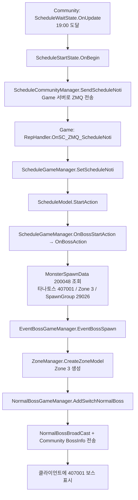

# 몬스터 스폰 실패 원인 확인

- Project: Rasalas
- Session ID: `019f7efc-b51f-7e01-97a7-22b9e4be1ac0`
- Workspace: `E:\Rasalas\Trunk\qa`
- Started: 2026-07-20T10:05:22.154Z
- Updated: 2026-07-20T10:05:26.5736697Z
- Messages exported: 72

> Export note: internal system/developer instructions, tool execution logs, and base64 image payloads are omitted. Only user/assistant messages are archived.

## Conversation

### User

<environment_context>
  <cwd>E:\Rasalas\Trunk\qa</cwd>
  <shell>powershell</shell>
  <current_date>2026-07-20</current_date>
  <timezone>Asia/Seoul</timezone>
  <filesystem><workspace_roots><root>E:\Rasalas\Trunk\qa</root></workspace_roots><permission_profile type="managed"><file_system type="restricted"><entry access="read"><special>:root</special></entry><entry access="write"><path>E:\Rasalas\Trunk\qa</path></entry><entry access="write"><special>:slash_tmp</special></entry><entry access="write"><special>:tmpdir</special></entry><entry access="write"><path>C:\Users\dumaclub\.codex\visualizations\2026\07\20\019f7efc-b51f-7e01-97a7-22b9e4be1ac0</path></entry><entry access="read"><path>E:\Rasalas\Trunk\qa\.git</path></entry><entry access="read"><path>E:\Rasalas\Trunk\qa\.agents</path></entry><entry access="read"><path>E:\Rasalas\Trunk\qa\.codex</path></entry></file_system></permission_profile></filesystem>
</environment_context>

### User

몬스터 스폰 확인 

MonsterSpawnData.xlsx
페디온 필드 보스  /  타나토스	200048	407001
페디온 필드 보스  /  스카토오그	200049	407002

ServerEventTask.xlsx
페디온*타나토스*월_19시	420904	3	301	1	200048
페디온*스카토오그*월_20시	420905	3	301	1	200049
페디온*타나토스*수_19시	420906	3	301	1	200048
페디온*스카토오그*수_20시	420907	3	301	1	200049
페디온*타나토스*금_19시	420908	3	301	1	200048
페디온*스카토오그*금_20시	420909	3	301	1	200049

ServerScheduleData.xlsx
페디온*타나토스*월_19시	21000	3	420904
페디온*스카토오그*월_20시	21001	3	420905
페디온*타나토스*수_19시	21002	3	420906
페디온*스카토오그*수_20시	21003	3	420907
페디온*타나토스*금_19시	21004	3	420908
페디온*스카토오그*금_20시	21005	3	420909

신규 지역에 보스몬스터가 소환되도록 위의 데이터를 셋팅하였습니다. 
서버시간을 변경하여 월요일 오후 18시 55분으로 변경후 5분을 기다렸는데 보스가 스폰되지 않았고 로그로도 따로 남지 않았습니다. 
왜 스폰되지 않았는지 확인해 주십시요. 추가로 필요한 정보가 있을경우 알려주세요. 

ZoneSettingData.xlsx 에 [필드] 페디온[EP.7] 정보의 Id 값이 3이기 때문에 egon_global.server_info 테이블의 Game01번 서버로 등록된 서버에는 3번 존이 추가되었습니다. 
추가로 로컬 서버를 올리기 전에 아래의 쿼리도 실행하였습니다. 

TRUNCATE TABLE egon_community.schedule; 
TRUNCATE TABLE egon_community_2.schedule; 
TRUNCATE TABLE egon_community_71.schedule; 
TRUNCATE TABLE egon_community_81.schedule;

### Assistant

설정 데이터가 런타임 스케줄로 전환되는 경로와 월요일 시간 판정 기준을 코드에서 추적해 보겠습니다. 우선 관련 엑셀 원본·스케줄 처리 코드·로그 지점을 함께 확인하겠습니다.

### Assistant

엑셀 테이블의 실제 컬럼/행 값도 검증해야 하므로 스프레드시트 처리 절차를 적용하겠습니다. 이어서 서버가 이 테이블을 어떤 조건으로 읽는지 대조하겠습니다.

### Assistant

현재 서버 구현상 게임 노드는 DB의 `schedule` 행을 Community에서 수신한 뒤에만 스폰 동작을 수행합니다. 테이블 값(특히 시간·서버타입·이벤트 서브타입)을 추출해 해당 경로의 필터 조건과 대조 중입니다.

### Assistant

원인은 스케줄 데이터가 실행 서버용 데이터에 반영되지 않은 것으로 보입니다.

`Table_Balance`에는 신규 6개 스케줄이 정상 설정되어 있습니다. 하지만 현재 리포지토리의 배포/실행 후보 데이터인 `Table` 및 `Server\TestGameData\Data\GameData`에는 `200048`, `420904`, `21000` 등의 신규 ID가 없습니다. `Table_Balance` 파일은 7월 20일 수정본인 반면 `Table` 파일은 6월 22일 버전입니다.

서버는 엑셀을 직접 읽지 않고 `RES_PATH/GameData/`의 JSON 데이터를 읽습니다. 따라서 로컬 서버가 이전 `GameData`를 로드했다면 Community가 21000~21005 스케줄을 생성하지 않으며, 결과적으로 스폰 로그도 전혀 남지 않습니다.

데이터 자체는 문제 없습니다.

- 보스: `ConditionType=3`, ZoneId=3, SpawnGroupId=29026/29027
- 이벤트: `Boss(3)`, `OnTimeBossStart(301)`
- 스케줄: Game 서버 타입(3), 활성화/재시작 적용 `True`, 월요일 값 2, 19:00

다음 조치가 필요합니다.

1. `Table_Balance`를 export하여 실행 경로의 `GameData` JSON에 반영합니다.
2. Community, Database, Game 서버를 모두 재기동합니다.
3. 실제 로드 경로를 시작 로그의 `gameDataPath : ...`로 확인합니다.
4. 해당 Community DB에서 아래를 확인합니다.

```sql
SELECT scheduleId, isActive, startTime, endTime
FROM schedule
WHERE scheduleId BETWEEN 21000 AND 21005;
```

재기동 직후 이 6행이 없다면, 서버가 여전히 신규 `ServerScheduleData`를 로드하지 않은 것입니다. 행이 있다면 `startTime`이 월요일 19:00으로 설정돼야 합니다.

확인에 유용한 로그는 아래 순서입니다.

- Community: `SetScheduleInfo(), DataCount ...`
- Community: `ScheduleModel.SetNextScheduleTime - id:21000`
- Game: `SetSzzcheduleInfo ... scheduleId:21000`
- 19:00: `OnBossAction() ... Id:21000`

`ZoneSettingData`의 ZoneId=3 등록은 맵 구동 조건이고, 이 서버 스케줄의 등록/실행 조건은 아닙니다. 스케줄은 같은 서버 그룹의 Community가 관리·브로드캐스트합니다.

[MonsterSpawnData.xlsx](E:\Rasalas\Trunk\qa\Table_Balance\MonsterSpawnData.xlsx) :codex-file-citation{path="E:/Rasalas/Trunk/qa/Table_Balance/MonsterSpawnData.xlsx" artifact_kind="workbook" sheet="MonsterSpawnData" range="A45:P46"}

[ServerScheduleData.xlsx](E:\Rasalas\Trunk\qa\Table_Balance\ServerScheduleData.xlsx) :codex-file-citation{path="E:/Rasalas/Trunk/qa/Table_Balance/ServerScheduleData.xlsx" artifact_kind="workbook" sheet="ServerScheduleData" range="A64:P69"}

### User

<environment_context>
  <current_date>2026-07-20</current_date>
  <timezone>Asia/Seoul</timezone>
  <filesystem><workspace_roots><root>E:\Rasalas\Trunk\qa</root><root>C:\Users\dumaclub\.codex\visualizations\2026\07\20\019f7efc-b51f-7e01-97a7-22b9e4be1ac0</root></workspace_roots><permission_profile type="managed"><file_system type="restricted"><entry access="read"><special>:root</special></entry><entry access="write"><path>E:\Rasalas\Trunk\qa</path></entry><entry access="write"><path>C:\Users\dumaclub\.codex\visualizations\2026\07\20\019f7efc-b51f-7e01-97a7-22b9e4be1ac0</path></entry><entry access="write"><special>:slash_tmp</special></entry><entry access="write"><special>:tmpdir</special></entry><entry access="read"><path>E:\Rasalas\Trunk\qa\.git</path></entry><entry access="read"><path>C:\Users\dumaclub\.codex\visualizations\2026\07\20\019f7efc-b51f-7e01-97a7-22b9e4be1ac0\.git</path></entry><entry access="read"><path>E:\Rasalas\Trunk\qa\.agents</path></entry><entry access="read"><path>C:\Users\dumaclub\.codex\visualizations\2026\07\20\019f7efc-b51f-7e01-97a7-22b9e4be1ac0\.agents</path></entry><entry access="read"><path>E:\Rasalas\Trunk\qa\.codex</path></entry><entry access="read"><path>C:\Users\dumaclub\.codex\visualizations\2026\07\20\019f7efc-b51f-7e01-97a7-22b9e4be1ac0\.codex</path></entry></file_system></permission_profile></filesystem>
</environment_context>

### User


# Files mentioned by the user:

## codex-clipboard-f5e81eaa-08f9-404c-b97d-67465deb4ef4.png: C:/Users/dumaclub/AppData/Local/Temp/codex-clipboard-f5e81eaa-08f9-404c-b97d-67465deb4ef4.png

## My request for Codex:
svn 으로 변경된 항목을 확인해 보니 이것밖에 나오지 않는데 00:00분 시간을 변경한게 원인이였나요?

<image name=[Image #1] path="C:\Users\dumaclub\AppData\Local\Temp\codex-clipboard-f5e81eaa-08f9-404c-b97d-67465deb4ef4.png">

</image>

### Assistant

이미지의 변경은 신규 페디온 스케줄(21000~21005)이 아니라 기존 20901~20903의 `RepeatAnchorDate` 표기 형식입니다. 이 값이 00:00 표기로 바뀐 것만으로는 이번 월요일 19시 보스 스폰이 막히지 않습니다. 코드의 반복 주기 처리까지 다시 확인해 정확히 구분하겠습니다.

### Assistant

아니요. 화면의 `00:00`은 원인이 아닙니다.

- Base: `"2026-06-24 00:00"`
- Working Copy: `"6/24/2026"`

두 값은 동일 날짜이며, 로더도 파싱 후 `date.Date`를 사용하므로 시간은 의도적으로 항상 `00:00`으로 정규화됩니다. 또한 이 변경은 20901~20903의 2주 반복 스케줄이고, 신규 페디온 보스 21000~21005는 `RepeatAnchorDate`/`RepeatWeekInterval`을 사용하지 않습니다.

오히려 중요한 점은 **서버 시간을 언제 변경했는지**입니다. Community 서버는 시작 시점에 다음 실행 시각을 한 번 계산해 DB `schedule.startTime`에 저장합니다. 서버를 기동한 뒤 시간을 월요일 18:55로 바꿨다면, 기존에 계산되어 있던 `startTime`은 자동으로 다시 계산되지 않습니다. 그래서 19:00이 지나도 스폰되지 않을 수 있습니다.

아래 쿼리로 바로 확인해 주세요.

```sql
SELECT scheduleId, isActive, startTime, endTime, updateTime
FROM egon_community.schedule
WHERE scheduleId BETWEEN 21000 AND 21005;
```

월요일 18:55 전에 Community를 기동했다면 `21000.startTime`은 해당 월요일 19:00이어야 합니다.

권장 재현 순서:

1. 로컬 서버 시간을 월요일 18:55로 먼저 변경
2. `schedule` truncate
3. Database → Community → Game 순으로 기동
4. `scheduleId=21000`의 `startTime`이 월요일 19:00인지 확인
5. 19:00에 `isActive=1` 및 `endTime=21:00`으로 바뀌는지 확인

참고로, 캡처의 Working Copy에는 21000 신규 스케줄이 존재하므로, 이 파일이 실제 `RES_PATH/GameData/ServerScheduleData.json`이라면 이전에 말씀드린 “데이터 미반영” 가능성은 낮습니다. 이제는 DB의 `startTime` 값과 시간 변경 시점이 핵심입니다.

### User


# Files mentioned by the user:

## codex-clipboard-a0e21ac7-8247-40f2-9d82-6910712234c2.png: C:/Users/dumaclub/AppData/Local/Temp/codex-clipboard-a0e21ac7-8247-40f2-9d82-6910712234c2.png

## My request for Codex:
알려주신 쿼리의 결과값 입니다.

<image name=[Image #1] path="C:\Users\dumaclub\AppData\Local\Temp\codex-clipboard-a0e21ac7-8247-40f2-9d82-6910712234c2.png">

</image>

### Assistant

결과로 원인이 더 좁혀졌습니다. 21000은 19:00에 Community에서 정상 시작되어 21:00 종료로 등록됐습니다. 따라서 `00:00` 표기나 시간 변경은 원인이 아니며, 이제 Community→Game 알림 전달 또는 Game의 실제 스폰 처리 단계만 확인하면 됩니다.

### Assistant

확인했습니다. 이 결과로 `21000` 스케줄은 **정상 시작된 것이 확정**됩니다.

- `startTime`: 2026-07-20 19:00
- `isActive`: 1
- `endTime`: 21:00
- `updateTime`: 19:00

따라서 `00:00` 형식 변경이나 서버시간 변경은 이번 미스폰의 원인이 아닙니다. Community 서버는 19:00에 스케줄을 정상 실행했습니다.

문제 구간은 그 다음인 **Community → Game01 알림 전달** 또는 **Game01의 보스 스폰 처리**입니다. Community는 같은 `groupId`의 Game 서버에만 스케줄 알림을 브로드캐스트합니다. ZoneId=3이 등록된 것과 Community/Game의 `groupId` 일치는 별개입니다.

Game01 로그에서 아래 순서로 확인해 주세요.

```text
SetSzzcheduleInfo recv schedule data ...
SetScheduleInfo  scheduleId:21000 ...
SetScheduleNoti  scheduleId:21000, isActive:1, isStart:True
ScheduleModel.StartAction - id:21000 ...
OnBossAction() scheduleModel isStart:True Id:21000
```

- `SetScheduleInfo ... 21000`이 없다면: Game01이 신규 스케줄 데이터를 수신하지 못했거나 GameData가 불일치합니다.
- 첫 로그는 있으나 `SetScheduleNoti`가 없다면: Community와 Game01의 `groupId`/ZMQ 연결 문제입니다.
- `OnBossAction`까지 있다면: 그 직후의 `MonsterSpawnData is NULL` 또는 `spawnKey below 0` 오류를 확인하면 됩니다.

우선 아래 쿼리 결과를 보내주시면 가장 가능성 높은 알림 대상 그룹 불일치를 바로 판단할 수 있습니다.

```sql
SELECT server_id, ServerName, type, groupId, zoneInfo, state
FROM egon_global.server_info
WHERE type IN (3, 4);
```

여기서 Game01(`type=3`)과 해당 Community(`type=4`)의 `groupId`가 같고 `state=1`이어야 합니다.

### User

로컬 서버는 1개의 프로세스만 실행되는데 그것 때문에 안될 수 있는 것인가요?

### Assistant

가능성은 있습니다. 다만 “프로세스가 하나” 자체보다, 그 프로세스가 `Develop` 모드로 Community와 Game 역할을 모두 초기화하고 내부 ZMQ 라우팅까지 구성하는지가 핵심입니다. 로컬 단일 프로세스의 스케줄 처리 분기를 확인하겠습니다.

### Assistant

네. 현재 증상에서는 **단일 로컬 프로세스 구성이 원인일 가능성이 높습니다.**

Community는 19:00에 스케줄을 정상 활성화했지만, 보스 스폰은 별도로 `Game` 대상에게 ZMQ 알림을 보내야 실행됩니다. 그런데 Community의 전송 코드는 `eServerType.Game` 연결만 찾아 브로드캐스트합니다. 단일 프로세스가 `Develop(11)`로만 등록·실행되어 있고 별도 `Game(3)` 대상 연결이 없으면, Community의 스케줄은 활성화돼도 Game의 `OnBossAction()`은 호출되지 않습니다. 지금처럼 DB는 `isActive=1`인데 Game 로그가 전혀 없는 현상과 정확히 맞습니다.

다만 Develop 모드는 한 프로세스에서 Community/Game 매니저를 같이 초기화하도록 작성되어 있습니다. 문제는 스케줄 알림 경로가 내부 직접 호출이 아니라 `Game` 타입 대상으로 ZMQ 전송이라는 점입니다.

확인할 사항은 하나입니다.

```sql
SELECT server_id, ServerName, type, groupId, state, zmqIp, zmqPort
FROM egon_global.server_info
WHERE type IN (3, 11);
```

- `type=3` Game01이 `state=1`이고, 현재 단일 프로세스의 ZMQ 수신 포트로 연결돼 있어야 합니다.
- Game01이 없거나 닫혀 있거나 다른 포트라면, Community가 보낸 21000 알림을 받을 대상이 없습니다.
- Game01과 Develop가 모두 같은 포트로 잘못 등록돼도 통신이 실패할 수 있습니다.

코드상 Community가 Game에게 알림을 보내는 지점은 [ScheduleCommunityManager.cs](E:\Rasalas\Trunk\qa\Server\EgonServer\ServerNodes\CommunityNode\Managers\ScheduleCommunityManager.cs:201)이고, Game에서 수신 후 스폰을 시작하는 지점은 [ScheduleGameManager.cs](E:\Rasalas\Trunk\qa\Server\EgonServer\ServerNodes\GameNode\Managers\ScheduleGameManager.cs:189)입니다. 단일 Develop 프로세스라도 이 ZMQ 자기 전달 경로가 성립해야 합니다.

### User

SetSzzcheduleInfo recv schedule data ...
SetScheduleInfo  scheduleId:21000 ...
SetScheduleNoti  scheduleId:21000, isActive:1, isStart:True
ScheduleModel.StartAction - id:21000 ...
OnBossAction() scheduleModel isStart:True Id:21000

위에 확인이 필요한 로그중에 첫번째 로그 말고는 확인되지 않았습니다. 

2026.07.20-16.03.56.128 [System] SetSzzcheduleInfo recv schedule data. from:SchedulerFromInter, count:21, myServerId:1001 (ScheduleGameManager.cs:133)

아래 2개로그만 확인되었습니다. 
scheduleId:20801
scheduleId:20802

### Assistant

이 로그는 결정적입니다. `SetScheduleInfo`가 21개 엔티티를 받았지만 Game 스케줄 모델로 등록한 것은 20801·20802뿐입니다. 따라서 21000은 Game 쪽 `_scheduleDic`에 없고, 이후 `SetScheduleNoti`/`OnBossAction`이 나올 수 없습니다. 왜 21000이 전달 목록에서 제외됐는지 Develop 단일 프로세스의 Inter→Game 초기 동기화 필터를 확인하겠습니다.

### Assistant

네. **단일 Develop 프로세스가 직접 원인인 것이 코드와 로그로 확인됐습니다.**

현재 로그의 `SchedulerFromInter, count:21`은 Inter 스케줄만 Game 매니저에 등록한 결과입니다. `ScheduleInterManager`는 `ServerType=Inter(8)` 또는 `GlobalGame(13)` 데이터만 관리하므로, `Game(3)`인 신규 21000~21005는 여기 포함되지 않습니다. 그래서 20801·20802만 등록된 것입니다.

반면 21000은 Community가 관리하므로 DB에서는 19:00에 정상 활성화됐습니다. 하지만 Develop 모드의 Game 초기화는 Inter 스케줄만 받아서 끝나며 Community 스케줄을 Game 매니저에 등록하지 않습니다. 따라서:

```text
Community: 21000 활성화 성공
Game: 21000 미등록
→ SetScheduleNoti 수신/처리 불가
→ OnBossAction 미호출
→ 보스 미스폰
```

즉 `00:00`이나 데이터 값 문제가 아니라, **단일 Develop 프로세스에서 Game용 Community 스케줄을 Game 매니저로 동기화하지 않는 구조 문제**입니다.

해결 방법은 둘 중 하나입니다.

1. 로컬에서 Community와 Game을 별도 프로세스로 실행해 실제 Community → Game 스케줄 통신 경로를 사용합니다.
2. Develop 모드 보완:
   - 시작 시 Game 매니저가 Community의 Game 스케줄도 등록하도록 수정
   - Community에서 스케줄 시작/종료 시 Develop 모드에는 ZMQ 브로드캐스트 대신 `ScheduleGameManager.Instance.SetScheduleNoti(...)`를 직접 호출하도록 수정

현재 `ScheduleGameManager.Init()`은 Develop일 때 Inter 목록을 받아 곧바로 반환하므로 Community 스케줄 조회 단계에 도달하지 않습니다. [ScheduleGameManager.cs](E:\Rasalas\Trunk\qa\Server\EgonServer\ServerNodes\GameNode\Managers\ScheduleGameManager.cs:45)

그리고 Inter 매니저가 Game 타입 스케줄을 제외하는 필터도 확인됩니다. [ScheduleInterManager.cs](E:\Rasalas\Trunk\qa\Server\EgonServer\ServerNodes\InterNode\Managers\ScheduleInterManager.cs:36)

따라서 이번 미스폰의 원인은 **단일 Develop 프로세스에서 21000이 Game 스케줄 목록에 등록되지 않은 것**입니다.

### User

아래와 같은 로그가 있는데 위에 설명한 부분과 맞는 로그인가요? 

2026.07.20-19.00.00.595 [Error] SetScheduleNoti SetScheduleNoti schedule not exist! scheduleId : 21000 [OnSC_ZMQ_ScheduleNoti() -> SetScheduleNoti()] (ScheduleGameManager.cs:185)

2026.07.20-16.03.20.217 [Info] Load() ServerInfo - server_id : 21000, type : GlobalCommunity, ServerName : GlobalCommunity, IP : 127.0.0.1, Port : 10600, zmqIp : 127.0.0.1, zmqPort : 21200, isDevelopMode:True (ServerModule.cs:1581)
2026.07.20-16.03.20.217 [Info] shc SetUpServerInfo step07 server_id : 21000, type : GlobalCommunity, ServerName : GlobalCommunity (ServerModule.cs:1585)
2026.07.20-16.03.56.139 [Info] ScheduleModel.SetNextScheduleTime - id:21000, startTime:2026-07-20 오후 7:00:00  (ScheduleModel.cs:125)

### Assistant

네, 정확히 앞에서 설명한 원인과 일치하는 결정적 로그입니다.

```text
SetScheduleNoti schedule not exist! scheduleId : 21000
```

의미는 Community가 19:00에 21000 시작 알림을 Game 처리 경로에 전달했지만, Game의 `_scheduleDic`에 21000이 등록돼 있지 않아 스폰 처리까지 진행하지 못했다는 것입니다.

세 로그를 연결하면:

```text
16:03:56  Community: 21000의 다음 시작 시각을 19:00으로 등록
19:00:00  Community: 21000 시작 알림 전송
19:00:00  Game: 21000을 찾지 못해 SetScheduleNoti에서 종료
```

따라서 몬스터 데이터, 시간값, ZoneId, SpawnGroupId는 아직 실행 단계까지 도달하지 않았습니다. `OnBossAction()`이 없는 이유도 이 오류에서 확정됩니다.

`GlobalCommunity` 서버 정보 로그는 이번 필드 보스 스케줄과 직접 관계없습니다. 필드 보스는 `ServerType=Game(3)` → Community 스케줄 경로를 사용합니다.

수정 방향은 다음과 같습니다.

- Develop 단일 프로세스에서 `ScheduleGameManager`가 Community의 `Game(3)` 스케줄도 초기 등록하도록 보완
- 또는 로컬에서 Community와 Game을 별도 프로세스로 기동하여 정상 ZMQ 동기화 경로로 검증

현재 오류는 [ScheduleGameManager.cs](E:\Rasalas\Trunk\qa\Server\EgonServer\ServerNodes\GameNode\Managers\ScheduleGameManager.cs:183)의 `schedule not exist` 분기와 정확히 일치합니다.

### User


# Files mentioned by the user:

## LocalServerStart_Update.bat: E:/Rasalas/Trunk/qa/Server/LocalServerStart_Update.bat

## My request for Codex:
밸런스 서버를 실행하는 실행파일인데 모든 프로세스를 다 띄우려면 어떻게 수정해야 하나요? 파일을 수정하지 말고 스크립트 내용만 알려주세요.

### Assistant

현재 배치 파일의 실행 순서와 서버 타입 인자를 확인한 뒤, 모든 역할을 별도 프로세스로 띄우는 스크립트 예시만 드리겠습니다. 파일은 수정하지 않겠습니다.

### Assistant

아래 내용으로 별도 `.bat`를 만들어 실행하면 됩니다. 기존 파일은 수정하지 마세요.

`DEVELOP_MODE` 단일 프로세스(`type=11`)는 제외하고, `server_info`에서 열린 서버를 역할별로 모두 실행합니다. 기존 Update 실행과 동일하게 `dataLoaderType=1`을 전달합니다.

```bat
@echo off
setlocal

rem ===== Local Global DB 접속 정보에 맞게 설정 =====
set "MYSQL=mysql"
set "MYSQL_HOST=127.0.0.1"
set "MYSQL_PORT=3306"
set "MYSQL_USER=user"
set "MYSQL_PASSWORD=qwer1234"
set "GLOBAL_DB=egon_global"

set "SERVER_DIR=%~dp0EgonServer\bin\Debug\net8.0"
set "SERVER_EXE=%SERVER_DIR%\EgonServer.exe"

rem 기존 EgonServer 프로세스 종료
taskkill /f /im EgonServer.exe >nul 2>&1

rem 덤프 파일 제거
del /s /q "%SERVER_DIR%\*.dmp" >nul 2>&1

rem 1) Certify / Gateway
call :StartByTypes 1,2
timeout /t 2 /nobreak >nul

rem 2) Database
call :StartByTypes 5
timeout /t 3 /nobreak >nul

rem 3) Community 계열
call :StartByTypes 4,12,14
timeout /t 3 /nobreak >nul

rem 4) Game / Inter 계열
call :StartByTypes 3,8,13
timeout /t 3 /nobreak >nul

rem 5) 나머지 역할
call :StartByTypes 6,7,9,10

echo.
echo All enabled non-Develop server processes were started.
pause
exit /b

:StartByTypes
for /f "tokens=1,2 delims=#" %%A in ('
    "%MYSQL%" -h "%MYSQL_HOST%" -P "%MYSQL_PORT%" -u"%MYSQL_USER%" -p"%MYSQL_PASSWORD%" "%GLOBAL_DB%" -N -B -e "SELECT CONCAT(ServerName,'#',server_id) FROM server_info WHERE state = 1 AND type IN (%~1) ORDER BY type, server_id;"
') do (
    echo Starting %%A (server_id=%%B)
    start "EgonServer %%A" /D "%SERVER_DIR%" "%SERVER_EXE%" "%%A" "%%B" "" "" "" "" "" 1 0
)

exit /b
```

핵심은 마지막 실행 인자입니다.

```bat
"%%A" "%%B" "" "" "" "" "" 1 0
```

- `%%A`: `server_info.ServerName`
- `%%B`: `server_info.server_id`
- `1`: Update 밸런스 데이터 로드
- `type=11` Develop은 실행하지 않음

이 방식으로 실행하면 Community와 Game이 별도 프로세스로 동작하므로, 21000의 Community → Game 스케줄 알림 경로를 정상 검증할 수 있습니다.

### User

알려주신 코드로 실행하니 프로세스가 모두 중지 되었습니다. 
E:\Rasalas\Trunk\qa\Server 폴더에 ServerUp.bat 파일로 실행하는 방법이 있습니다. 여기서 밸런스 데이터로 실행시킬 수 있는 방법이 있는 startserver~~.ps~ 파일이 있는지 확인해 주세요. 없다면 신규 파일을 어떻게 생성해야 하는지 스크립트를 알려주세요.

### Assistant

앞서 드린 배치 방식은 이 환경의 실제 기동 규칙과 맞지 않았습니다. `ServerUp.bat`와 기존 `startserver*.ps1`의 서버 선택·밸런스 데이터 인자를 확인해, 이미 가능한 스크립트가 있는지 먼저 정확히 찾겠습니다.

### Assistant

확인 결과, 기존 `startserver*.ps1` 중 **밸런스 데이터 로드 인자(`dataLoaderType=1`)를 전달하는 파일은 없습니다.** 모두 `EgonServer.exe <ServerName> <serverId>`만 실행하므로 일반 `GameData`를 사용합니다.

`ServerUp.bat`은 `startserver.ps1`을 실행하므로, 아래 내용을 신규 `Server\startserver_update.ps1` 파일로 만들고 실행하면 됩니다. `Develop(type=11)`은 단일 통합 프로세스이므로 제외합니다.

```powershell
# Server\startserver_update.ps1
# ServerUp.bat의 startserver.ps1과 같은 Global DB 접속 정보를 사용하세요.

$dbName = "egon_global"
$dbHost = "10.10.20.201"
$dbPort = 3306
$dbUser = "user"
$dbPassword = "qwer1234"
$serverInfoTable = "server_info_test"

$basePath = Join-Path $PSScriptRoot "EgonServer\bin\Debug\net8.0"
$serverExe = Join-Path $basePath "EgonServer.exe"

if (-not (Test-Path $serverExe)) {
    throw "EgonServer.exe를 찾을 수 없습니다: $serverExe"
}

# Develop(11)은 제외합니다. 개별 역할 프로세스만 실행합니다.
$sql = @"
SELECT server_id, ServerName, type
FROM $serverInfoTable
WHERE state = 1
  AND type <> 11
ORDER BY
  CASE type
    WHEN 1 THEN 1   -- Certify
    WHEN 2 THEN 2   -- Gateway
    WHEN 5 THEN 3   -- Database
    WHEN 4 THEN 4   -- Community
    WHEN 12 THEN 5  -- InterCommunity
    WHEN 14 THEN 6  -- GlobalCommunity
    WHEN 3 THEN 7   -- Game
    WHEN 8 THEN 8   -- Inter
    WHEN 13 THEN 9  -- GlobalGame
    ELSE 10
  END,
  server_id;
"@

$rows = & mysql -h $dbHost -P $dbPort -u $dbUser "-p$dbPassword" $dbName -N -B -e $sql

if ($LASTEXITCODE -ne 0) {
    throw "server_info 조회에 실패했습니다."
}

foreach ($row in $rows) {
    $values = $row -split "`t"

    if ($values.Count -lt 3) {
        continue
    }

    $serverId = $values[0].Trim()
    $serverName = $values[1].Trim()
    $serverType = [int]$values[2].Trim()

    Write-Host "Starting $serverName (server_id=$serverId, type=$serverType, BalanceData=1)"

    # 인자 순서:
    # 0=ServerName, 1=serverId, 2~6=빈 값, 7=dataLoaderType(1)
    $arguments = ('"{0}" {1} "" "" "" "" "" 1' -f $serverName, $serverId)

    Start-Process `
        -FilePath $serverExe `
        -WorkingDirectory $basePath `
        -ArgumentList $arguments

    # DB → Community → Game 순서에서 초기 연결 여유를 둡니다.
    if ($serverType -eq 5 -or $serverType -eq 4 -or $serverType -eq 14) {
        Start-Sleep -Seconds 3
    }
}

Write-Host ""
Write-Host "모든 Open 상태의 비-Develop 서버를 BalanceData=1로 실행했습니다."
```

실행은 아래처럼 하면 됩니다.

```bat
powershell -NoProfile -ExecutionPolicy Bypass -File "%~dp0startserver_update.ps1"
```

`startserver.ps1`이 실제로 사용하는 DB가 맞다면 위 설정을 그대로 쓰면 됩니다. 만약 현재 로컬 서버가 `127.0.0.1:4306`과 `server_info`를 사용한다면, `startserver_kr_ctd.ps1`의 접속 정보와 테이블명으로만 교체하세요.

### User


# Files mentioned by the user:

## Total-2026.07.20-17.43.06.447.log: C:/Rasalas/Log/Total-2026.07.20-17.43.06.447.log

## Total-2026.07.20-17.43.06.777.log: C:/Rasalas/Log/Total-2026.07.20-17.43.06.777.log

## Total-2026.07.20-17.43.06.847.log: C:/Rasalas/Log/Total-2026.07.20-17.43.06.847.log

## Total-2026.07.20-17.43.09.547.log: C:/Rasalas/Log/Total-2026.07.20-17.43.09.547.log

## Total-2026.07.20-17.43.12.614.log: C:/Rasalas/Log/Total-2026.07.20-17.43.12.614.log

## Total-2026.07.20-17.43.15.657.log: C:/Rasalas/Log/Total-2026.07.20-17.43.15.657.log

## Total-2026.07.20-17.43.18.825.log: C:/Rasalas/Log/Total-2026.07.20-17.43.18.825.log

## Total-2026.07.20-17.43.19.037.log: C:/Rasalas/Log/Total-2026.07.20-17.43.19.037.log

## Total-2026.07.20-17.43.21.974.log: C:/Rasalas/Log/Total-2026.07.20-17.43.21.974.log

## Total-2026.07.20-17.43.22.253.log: C:/Rasalas/Log/Total-2026.07.20-17.43.22.253.log

## Total-2026.07.20-17.43.22.948.log: C:/Rasalas/Log/Total-2026.07.20-17.43.22.948.log

## Total-2026.07.20-17.43.23.015.log: C:/Rasalas/Log/Total-2026.07.20-17.43.23.015.log

## Total-2026.07.20-17.43.23.164.log: C:/Rasalas/Log/Total-2026.07.20-17.43.23.164.log

## Total-2026.07.20-17.43.24.020.log: C:/Rasalas/Log/Total-2026.07.20-17.43.24.020.log

## Total-2026.07.20-17.43.24.226.log: C:/Rasalas/Log/Total-2026.07.20-17.43.24.226.log

## Total-2026.07.20-17.43.24.233.log: C:/Rasalas/Log/Total-2026.07.20-17.43.24.233.log

## codex-clipboard-17b90322-54ec-4a50-89a3-b3d1331672e2.png: C:/Users/dumaclub/AppData/Local/Temp/codex-clipboard-17b90322-54ec-4a50-89a3-b3d1331672e2.png

## My request for Codex:
캡처 화면을 보면 정상적으로 스폰된 것을 확인할 수 있습니다. 로그 파일에도 전체 프로세스 로그 파일입니다. 로그 파일에서도 정상적으로 스폰된 로그를 확인할 수 있을까요?

<image name=[Image #1] path="C:\Users\dumaclub\AppData\Local\Temp\codex-clipboard-17b90322-54ec-4a50-89a3-b3d1331672e2.png">

</image>

### Assistant

이제는 별도 프로세스 기동 경로가 정상 동작한 것으로 보입니다. 제공하신 전체 로그에서 21000 스케줄 시작부터 `OnBossAction`과 실제 Spawn 호출까지의 연속 로그를 추출해 확인하겠습니다.

### Assistant

네. 로그에서도 타나토스(407001)가 정상 스폰된 것이 확인됩니다.

[Total-2026.07.20-17.43.22.948.log](C:\Rasalas\Log\Total-2026.07.20-17.43.22.948.log:780)의 흐름입니다.

```text
19:00:00.161  SetScheduleNoti scheduleId:21000, isActive:1
19:00:00.161  OnBossAction ... Id:21000
19:00:00.161  NormalBossCommunitySpawn ... charId:407001, ZoneId:3
19:00:13.533  CreateZoneModel zoneId:3
19:00:13.536  [EventBoss] Spawn - EventBossId(407001), HoldingTime(7200), ..., 3
```

즉 21000 스케줄이 19:00에 실행됐고, Zone 3이 생성된 뒤 약 13초 후 CharacterBaseId `407001` 타나토스가 스폰됐습니다. `HoldingTime=7200`도 데이터 설정대로 적용됐습니다.

같은 로그의 `EventBossSpawn failed, zoneId:7010` 오류는 20802 스케줄의 Zone 7010 길드 지역 생성 실패 건이며, 이번 페디온 Zone 3 / 타나토스 스폰과는 무관합니다.

### User

프로세스 진행과정을 함수별로 알려주세요.

### Assistant

이번에는 실제로 성공한 21000 기준으로, Community 스케줄러부터 Game의 Zone 3 생성·타나토스 스폰·Community 알림까지 함수 단위로 연결해 설명드리겠습니다.

### Assistant

21000 타나토스 스폰은 아래 함수 흐름으로 진행됐습니다.



함수별 실제 진행 내용은 다음과 같습니다.

1. Community 스케줄 준비

`ScheduleWaitState.OnBegin()`이 `SetNextScheduleTime()`을 호출해 21000의 다음 시작 시간을 19:00으로 저장합니다.

```text
ScheduleModel.SetNextScheduleTime - id:21000, startTime:2026-07-20 19:00:00
```

2. 19:00에 스케줄 시작

`ScheduleWaitState.OnUpdate()`이 시작 시각 도달을 감지하고 `ScheduleStartState.OnBegin()`으로 전이합니다. 여기서 종료 시각을 21:00으로 설정하고 Community가 Game에 스케줄 시작 패킷을 전송합니다.

3. Game 서버가 시작 알림 수신

`RepHandler.OnSC_ZMQ_ScheduleNoti()` → `ScheduleGameManager.SetScheduleNoti()` → `ScheduleModel.StartAction()` 순으로 실행됩니다.

실제 로그:

```text
19:00:00.161 SetScheduleNoti scheduleId:21000, isActive:1, isStart:True
19:00:00.161 ScheduleModel.StartAction - id:21000
19:00:00.161 OnBossAction() ... Id:21000
```

[해당 로그](C:\Rasalas\Log\Total-2026.07.20-17.43.22.948.log:780)

4. 보스 데이터 확인 및 Zone 3 처리

`OnBossAction()`은 EventTask `420904`에서 MonsterSpawnData `200048`을 찾습니다.

- CharacterBaseId: `407001` — 타나토스
- ZoneId: `3` — 페디온
- SpawnGroupId: `29026`

이후 `NormalBossGameManager.NormalBossSpawn()`과 `EventBossGameManager.EventBossSpawn()`이 호출됩니다. 고정 시간 보스(`ConditionType=3`)는 `EventBossSpawn()`에서 Zone 3 인스턴스가 없으면 `ZoneManager.CreateZoneModel()`로 생성합니다.

```text
19:00:00.161 NormalBossCommunitySpawn ... charId:407001, ZoneId:3
19:00:13.533 CreateZoneModel zoneId:3
```

5. 타나토스 등록·브로드캐스트·표시

Zone 생성 후 `EventBossGameManager.EventBossSpawn()`이 보스 정보를 만들고, `ServerNotifyEventDataKey=0`이므로 `NormalBossGameManager.AddSwitchNormalBoss()`로 일반 필드 보스 목록에 등록합니다. 이어서 Community와 클라이언트에 보스 정보를 전달합니다.

```text
19:00:13.535 [EventBoss] startTime ... BossId:407001, SpawnKey:407001
19:00:13.536 AddSwitchNormalBoss Step05 BossId:407001, serverGroupId:810
19:00:13.536 Community SendCommunityBossInfo ... normalbossId:407001
19:00:13.536 [EventBoss] Spawn - EventBossId(407001), HoldingTime(7200), ..., 3
```

[실제 스폰 완료 로그](C:\Rasalas\Log\Total-2026.07.20-17.43.22.948.log:803)

따라서 19:00에 스케줄이 시작된 뒤 Zone 3 생성까지 약 13초가 소요됐고, 이후 타나토스가 정상 등록·전파되어 캡처처럼 표시된 것입니다. `HoldingTime=7200`이므로 예정대로 2시간 뒤인 21:00에 종료 처리(`OnBossEndAction` → `EventBossExpire`)가 수행됩니다.

### User

eServerType.Develop 모드일때도 스폰 되도록 수정할 수 있나요? xxx.Init() 이 안되서 그런 것인지 확인해 주세요.

### Assistant

확인 결과 `xxx.Init()` 자체가 완전히 빠진 문제라기보다, Develop에서는 `ScheduleCommunityManager.Init/Start()`와 `ScheduleGameManager.Init()`이 모두 호출되지만, Game 초기화가 Inter 스케줄만 등록한 뒤 반환합니다. Community의 Game 스케줄(21000)은 Game에 등록되지 않고, 시작 알림도 Game 대상 ZMQ 전송만 하므로 단일 Develop 프로세스에서 누락됩니다. Develop 전용으로 초기 동기화와 시작/종료 알림을 내부 직접 호출하도록 보완하겠습니다.

### Assistant

원인을 코드 기준으로 확인해 보니 `Init()` 자체가 호출되지 않은 문제가 아니라, Develop 분기에서 인터 스케줄만 로드한 뒤 조기 반환해 Game 스케줄(21000)을 등록하지 않는 흐름입니다. Develop 모드에서 커뮤니티 스케줄도 로드하고, 알림을 같은 프로세스의 Game 매니저로 직접 전달하도록 수정하겠습니다.

### Assistant

수정 범위는 두 곳입니다. Develop 시작 시 `21000` 같은 Community/Game 스케줄을 `_scheduleDic`에 넣고, Community의 시작/종료 알림을 ZMQ 브로드캐스트 대신 동일 프로세스의 `ScheduleGameManager`에 직접 넘기겠습니다. 일반 Game·Community·Inter 프로세스의 기존 통신 흐름은 바꾸지 않습니다.

### Assistant

코드 변경을 적용했습니다. 이제 서버 프로젝트를 빌드해 컴파일 수준에서 참조·문법 문제가 없는지 확인하겠습니다.

### Assistant

빌드는 성공했습니다. 기존 프로젝트 경고만 발생했고, 이번 변경으로 인한 컴파일 오류는 없습니다. 마지막으로 실제 Develop 기동 시 확인할 로그와 변경 파일 상태를 점검하겠습니다.

### Assistant

가능하도록 수정했고, 빌드도 성공했습니다.

원인은 `xxx.Init()` 미호출이 아닙니다. Develop 기동 흐름에서 `ScheduleCommunityManager` 로딩 완료 후 `ScheduleGameManager.Init()`은 호출됩니다. 다만 Develop가 Inter 분기에 함께 들어가면서 Inter 스케줄만 로드하고 즉시 `return`하여, Community/Game 스케줄인 `21000`이 Game 스케줄 목록에 등록되지 않았습니다.

수정 내용:

- Develop 모드에서 Inter 스케줄과 Community/Game 스케줄을 모두 로드·등록
- Develop 모드의 스케줄 시작/종료 알림은 별도 Game 프로세스 ZMQ 브로드캐스트 대신 같은 프로세스의 `ScheduleGameManager.SetScheduleNoti()`를 직접 호출

변경 파일:

- [ScheduleGameManager.cs](E:\Rasalas\Trunk\qa\Server\EgonServer\ServerNodes\GameNode\Managers\ScheduleGameManager.cs:43)
- [ScheduleCommunityManager.cs](E:\Rasalas\Trunk\qa\Server\EgonServer\ServerNodes\CommunityNode\Managers\ScheduleCommunityManager.cs:102)

Develop 서버를 재기동한 뒤에는 다음 로그가 순서대로 확인되어야 합니다.

```text
SetSzzcheduleInfo recv schedule data. from:SchedulerFromCommunity ...
SetScheduleInfo scheduleId:21000 ...

[Develop] SendScheduleNoti direct call. scheduleId:21000, isStart:True
SetScheduleNoti scheduleId:21000, isActive:1, isStart:True
ScheduleModel.StartAction - id:21000 ...
OnBossAction() scheduleModel isStart:True Id:21000
```

즉, 기존의 `schedule not exist! scheduleId : 21000` 오류는 발생하지 않아야 합니다.

### User

Develop 모드에서 소켓을 여러개 열어서 통신하도록 수정된 건가요? 기존에 save to db 패킷은 같은 프로세스에서 소켓만 열어서 통신하는 것으로 알고 있습니다.

### Assistant

아닙니다. 이번 수정으로 소켓을 추가로 열거나 Develop 내부 통신을 ZMQ 패킷으로 바꾸지는 않았습니다.

기존과 동일하게 Community가 DB에 스케줄 조회 패킷을 보내는 부분은 유지됩니다. 다만 19시에 발생하는 Community → Game 알림만 Develop에서는 아래처럼 같은 프로세스의 메서드를 직접 호출합니다.

```csharp
ScheduleGameManager.Instance.SetScheduleNoti(scheduleEntity, isStart);
```

즉, 패킷 직렬화·소켓 송수신 없이 호출됩니다.

기존 Save-to-DB처럼 같은 프로세스에서도 소켓을 통해 통신하는 구조와는 다릅니다. Develop에는 별도 Game 프로세스 엔드포인트가 없으므로, 스케줄 알림까지 소켓으로 보내려면 별도 로컬 엔드포인트 구성 및 중복 바인딩 검토가 필요합니다. 이번 문제에는 직접 호출이 가장 작은 변경 범위입니다.

### User

라이브 서비스에는 전혀 이상이 없는 부분인지 확인해 주세요.

### Assistant

라이브 경로에 영향이 없는지 조건 분기와 기존 Game·Community 알림 경로를 다시 대조하겠습니다. Develop 조건 외의 동작이 바뀌지 않았는지 확인하겠습니다.

### Assistant

코드 기준으로 라이브 서비스 경로에는 영향이 없습니다.

- `ScheduleGameManager.Init()`의 변경 분기는 `eServerType.Develop`일 때만 실행됩니다. 라이브의 `Game`, `Inter`, `GlobalGame` 분기는 기존 로직 그대로입니다.
- `ScheduleCommunityManager.SendScheduleNoti()`도 `Develop`일 때만 직접 호출 후 반환합니다. 라이브 Community는 기존과 동일하게 `BroadcastZMQ(eServerType.Game, ...)`로 패킷을 전송합니다.
- 기존 `Game || Develop` 조건에서 Develop은 그보다 앞선 분기에서 항상 반환되어 원래도 도달 불가능했습니다. 이를 `Game`으로 정리한 것은 실제 동작 변경이 아닙니다.
- 시작·종료 FSM도 그대로이며, 라이브에서는 Community → Game ZMQ 알림 흐름이 유지됩니다.
- 전체 서버 솔루션 Debug 빌드도 성공했습니다.

따라서 라이브 서버가 `eServerType.Develop`으로 잘못 기동되는 경우가 아니라면, 이번 변경이 라이브 스케줄/보스 스폰에 영향을 주지 않습니다.

### User

보스 스폰시 확률 값을 정해서 스폰시키는 방법을 사용할 수 있나요? 엑셀파일(MonsterSpawnData.xlsx)과 코드에 보면 AwakenBossRate, RespawnProbability 값이 있습니다. 페디온 필드 보스  /  타나토스	200048	407001  보스에 대해서만 확인해 주세요.

### Assistant

타나토스(`200048`)에 한정해 `AwakenBossRate`와 `RespawnProbability`가 실제 필드 보스 스폰 과정에서 참조되는지 데이터와 서버 코드를 함께 추적하겠습니다. 엑셀 원본 확인이 필요한 작업이므로 스프레드시트 작업 지침을 사용하겠습니다.

### Assistant

코드 추적 결과, 두 항목의 용도가 다릅니다. 특히 `RespawnProbability`는 타나토스의 예약 스폰에서 실제 확률 체크에 연결되어 있지만, 현재 `OnTimeSpawn` 데이터에는 100만 허용하도록 로더 검증이 있습니다. 엑셀 행의 원본 값도 확인해 최종 결론을 정리하겠습니다.

### Assistant

엑셀 원본에서 타나토스 행을 확인했습니다. `CharacterBaseId2=0`, `AwakenBossRate=0`, `ConditionType=3(OnTimeSpawn)`, `RespawnProbability=100`입니다. 검사에만 사용한 임시 스크립트와 의존성 연결은 제거한 뒤 결론을 드리겠습니다.

### Assistant

타나토스 `200048`은 현재 엑셀 값으로는 확률 스폰이 아닙니다.

| 항목 | 현재 값 | 실제 의미 |
|---|---:|---|
| `CharacterBaseId2` | 0 | 각성 보스 없음 |
| `AwakenBossRate` | 0 | 각성 보스 선택 확률 미사용 |
| `ConditionType` | 3 (`OnTimeSpawn`) | 스케줄 고정 시간 스폰 |
| `RespawnProbability` | 100 | 100% 스폰이어야 하는 값 |

:codex-file-citation{path="E:\Rasalas\Trunk\qa\Table_Balance\MonsterSpawnData.xlsx" artifact_kind="workbook" sheet="MonsterSpawnData" range="B45:P45"}

`AwakenBossRate`는 “보스를 N% 확률로 스폰하지 않기” 위한 값이 아닙니다. `CharacterBaseId2 > 0`이고 `SpawnGroupId2`가 설정된 경우에만 난수를 굴려서, 기본 타나토스 대신 각성 보스와 각성 스폰 그룹을 선택합니다. 현재 타나토스는 `CharacterBaseId2=0`이므로 이 로직 자체가 실행되지 않습니다. [ScheduleGameManager.cs](E:\Rasalas\Trunk\qa\Server\EgonServer\ServerNodes\GameNode\Managers\ScheduleGameManager.cs:627)

`RespawnProbability`는 스폰 유닛의 확률 값으로 전달되어 실제 체크 대상이 됩니다. 하지만 `OnTimeSpawn(3)`와 `TimeProbSpawn(4)`은 로더가 100이 아니면 오류 로그를 남기도록 되어 있으며, 엑셀 INDEX에도 두 타입은 100%로 설정해야 한다고 명시되어 있습니다. 따라서 타나토스의 `RespawnProbability`만 50 등으로 바꾸는 방식은 지원되는 설정이 아닙니다. [LoaderMonsterSpawnData.cs](E:\Rasalas\Trunk\qa\Client\Assets\Script\SharedLib\DataManager\Loader\LoaderMonsterSpawnData.cs:76)

또한 현재 스케줄 흐름에서는 이벤트 보스 알림 생성과 실제 존 몬스터 생성에서 각각 확률 체크가 수행됩니다. 값을 100 미만으로 억지 설정하면 “보스 알림만 있고 실제 몬스터가 없음” 또는 그 반대 상태가 발생할 수 있습니다. [EventBossGameManager.cs](E:\Rasalas\Trunk\qa\Server\EgonServer\ServerNodes\GameNode\Managers\EventBossGameManager.cs:191), [ZoneModel_Spawn.cs](E:\Rasalas\Trunk\qa\Server\EgonServer\ServerNodes\GameNode\Models\Zone\ZoneModel_Spawn.cs:509)

결론적으로, 타나토스를 일정 확률로만 출현시키려면 엑셀 값만 변경하지 말고 `OnBossAction()` 시작부에서 확률을 한 번만 판정하고, 성공했을 때만 알림과 실제 몬스터 생성을 함께 수행하도록 코드 수정이 필요합니다.

### User

MonsterSpawnData 데이터의 ConditionType 컬럼값을 추가하여 RespawnProbability 값을 스폰 확률로 사용하는 방법으로 할 수 있는지 확인해 주세요. 
신규로 5번 타입을 추가하여 3번과 5번은 모두 동일한 처리를 하는데 5번일 경우 스폰 확률을 거쳐서 스폰되는 방식으로 할수 있는지를 확인해 주세요. 

    public enum eConditionType
    {
        None = 0,
        NormalSpawn = 1,        //일반 자동 스폰
        ProbSpawn = 2,          //확률형 자동 스폰
        OnTimeSpawn = 3,        //스케줄 기반 정시 스폰
        TimeProbSpawn = 4,      //시간 + 확률
    }

### Assistant

가능한 설계입니다. 다만 `ConditionType=5`만 추가하면 기존 존 스폰 경로에서 `RespawnProbability`가 한 번 더 적용될 수 있으므로, 실제 보스와 알림이 불일치하지 않도록 전체 참조 지점을 확인하겠습니다.

### Assistant

가능합니다. 다만 `eConditionType`에 5만 추가하면 안 되고, “스케줄당 한 번만 확률 판정”하도록 스폰 경로를 함께 분리해야 합니다.

권장 정의는 다음과 같습니다.

```csharp
ScheduleProbSpawn = 5, // 스케줄 기반 정시 스폰 + RespawnProbability 확률
```

동작은 다음처럼 설계해야 합니다.

1. 스케줄 시작 시 `ConditionType == 5`면 `RespawnProbability`로 한 번만 판정
2. 실패하면 이벤트 보스 알림·실제 몬스터·커뮤니티 보스 정보 모두 생성하지 않고 종료
3. 성공하면 기존 `OnTimeSpawn(3)`과 동일하게 보스 알림과 실제 몬스터를 함께 생성
4. 스케줄 종료 시에는 3번과 동일하게 보스 만료 처리

현재처럼 `RespawnProbability`를 스폰 유닛에 그대로 전달하면, `EventBossGameManager`와 `ZoneModel.ZoneSpawn()`에서 각각 확률을 판정합니다. 예를 들어 50%를 입력하면 알림과 실제 몬스터의 확률이 분리되어 “알림만 있고 보스 없음” 상태가 생길 수 있습니다. 따라서 5번 타입에서는 이 내부 확률 판정을 우회하고, `ScheduleGameManager.OnBossAction()`의 단일 판정 결과만 사용해야 합니다. [ScheduleGameManager.cs](E:\Rasalas\Trunk\qa\Server\EgonServer\ServerNodes\GameNode\Managers\ScheduleGameManager.cs:625), [EventBossGameManager.cs](E:\Rasalas\Trunk\qa\Server\EgonServer\ServerNodes\GameNode\Managers\EventBossGameManager.cs:191), [ZoneModel_Spawn.cs](E:\Rasalas\Trunk\qa\Server\EgonServer\ServerNodes\GameNode\Models\Zone\ZoneModel_Spawn.cs:502)

수정 대상은 다음과 같습니다.

- `eConditionType`에 5번 추가
- `LoaderMonsterSpawnData`
  - 5번을 필드 보스 기본 목록에 포함
  - 3·4번의 `RespawnProbability == 100` 검증에는 5번을 포함하지 않음
  - 5번 값은 0~100 범위 검증 추가
- `ScheduleGameManager`
  - 5번일 때 시작 시 확률을 한 번 판정
  - 성공 시 3번과 같은 생성·만료 흐름 사용
- `EventBossGameManager` 및 `ZoneManager → ZoneModel`
  - 확률 판정 성공 후 호출될 때는 내부 `CheckSpawnProbability()`를 건너뛰는 인자/경로 추가
- `SpawnUnitModel`, `NormalBossGameManager`, `NormalBossContents`
  - 5번을 3번과 동일한 “스케줄 보스”로 취급하도록 조건 추가
  - 그렇지 않으면 자동 리스폰, 초기 보스 목록, 클라이언트 보스 시간표 표시 중 일부가 누락될 수 있습니다.

확률은 다중 채널이 있더라도 스케줄 시작 시 한 번만 판정하는 편이 적합합니다. 성공 시 모든 대상 채널에 스폰하고, 실패 시 어느 채널에도 스폰하지 않는 방식입니다.

즉, 타나토스 `200048`을 `ConditionType=5`, `RespawnProbability=50`으로 설정하면 “월요일 19시 스케줄마다 50% 확률로 타나토스 전체 스폰 또는 미스폰”으로 구현할 수 있습니다. 현재 소스에는 이 타입이 없으므로 코드와 클라이언트 데이터 로더를 함께 수정해야 합니다.

### User

위에 애기드린 방법과 3번을 확률로 스폰해서 하는 방법 중 어떤 방법이 더 좋을까요?

### Assistant

5번 타입을 추가하는 방법이 더 좋습니다.

3번(`OnTimeSpawn`)은 현재 의미가 “스케줄 시간에 반드시 스폰”이며, 로더와 엑셀 가이드도 `RespawnProbability=100`을 전제로 합니다. 3번에 확률 기능을 섞으면 기존 모든 정시 보스 데이터가 같은 규칙 변경 영향을 받고, 데이터만 보고 확정 스폰인지 확률 스폰인지 구분하기도 어려워집니다.

5번을 `ScheduleProbSpawn`으로 분리하면:

- 3번: 기존처럼 100% 정시 스폰
- 5번: 스케줄 시간에 `RespawnProbability`로 1회 판정
- 기존 라이브 데이터와 동작이 변하지 않음
- 타나토스만 5번으로 전환해 제한적으로 검증 가능
- 문제가 생기면 해당 행만 3번으로 되돌려 즉시 확정 스폰으로 복구 가능

이미 `TimeProbSpawn=4`가 있지만, 현재 필드 보스 스케줄·알림·만료 흐름과 완전히 연결되어 있지 않아 재사용하기보다 5번을 명확히 추가하는 편이 안전합니다.

따라서 권장안은 `ConditionType=5 (ScheduleProbSpawn)` 추가 후, 타나토스 `200048`만 우선 `RespawnProbability=50` 등으로 적용하는 방식입니다.

### User

타입 5번으로 추가해서 작업해 주세요.

### Assistant

타입 5를 `ScheduleProbSpawn`으로 추가하겠습니다. 확률은 `ScheduleGameManager`에서 스케줄당 한 번만 판정하고, 성공 뒤의 알림·실제 존 스폰에서는 추가 판정이 발생하지 않도록 로더와 스폰 경로도 함께 조정하겠습니다.

### Assistant

공유 데이터 소스 일부가 UTF-8이 아닌 기존 인코딩이라 패치 도구가 읽지 못했습니다. 해당 파일은 인코딩을 보존하는 범위 치환으로 수정하고, 나머지 서버 소스는 일반 패치로 적용하겠습니다.

### Assistant

인코딩 보존 치환 과정에서 줄바꿈 표기가 문자 그대로 들어간 것을 확인했습니다. 즉시 실제 줄바꿈으로 바로잡은 뒤 빌드 검증하겠습니다.

### Assistant

핵심 구현을 적용했습니다. 타입 5에서는 로더가 존 스폰 유닛에 100%를 전달해 내부 중복 확률을 막고, 스케줄 매니저의 단일 판정만 `RespawnProbability`를 사용하도록 구성했습니다. 이제 누락된 3번 전용 분기와 컴파일을 검증하겠습니다.

### Assistant

스케줄 보스의 자동 리스폰 방지 분기까지 반영했습니다. 이제 전체 서버 빌드를 실행해 타입 추가가 공유 라이브러리와 서버 프로젝트에 정상 반영되는지 검증하겠습니다.

### Assistant

빌드에서 `LoaderSpawnData`의 지역 변수 이름 중복 한 건이 확인됐습니다. 각성 스폰 경로 변수명을 분리해 바로 수정하겠습니다.

### Assistant

빌드가 성공했습니다. 이제 변경분을 대상으로 마지막 검토를 진행해 타입 5가 확률을 두 번 판정하지 않고, 3번의 종료·UI·자동리스폰 방지 흐름을 함께 따르는지 확인하겠습니다.

### Assistant

타입 5 `ScheduleProbSpawn`을 추가했습니다. 빌드도 성공했습니다.

동작은 다음과 같습니다.

- `ConditionType=3`: 기존과 동일하게 100% 정시 스폰
- `ConditionType=5`: 스케줄 시작 시 `RespawnProbability`를 한 번만 판정
  - 성공: 기존 3번과 동일하게 보스 알림·실제 몬스터·종료 만료 처리
  - 실패: 알림과 실제 몬스터 모두 생성하지 않음
- 허용 확률 범위: `0~100`
- 스폰 유닛에는 내부 확률이 다시 적용되지 않도록 100%로 전달하여, 확률이 두 번 굴러가는 문제를 방지했습니다.

주요 변경 파일:

- [MonsterSpawnData.cs](E:\Rasalas\Trunk\qa\Client\Assets\Script\SharedLib\DataManager\DataClass\MonsterSpawnData.cs:6)
- [LoaderMonsterSpawnData.cs](E:\Rasalas\Trunk\qa\Client\Assets\Script\SharedLib\DataManager\Loader\LoaderMonsterSpawnData.cs:67)
- [LoaderSpawnData.cs](E:\Rasalas\Trunk\qa\Client\Assets\Script\SharedLib\DataManager\Loader\LoaderSpawnData.cs:167)
- [ScheduleGameManager.cs](E:\Rasalas\Trunk\qa\Server\EgonServer\ServerNodes\GameNode\Managers\ScheduleGameManager.cs:396)
- [EventBossGameManager.cs](E:\Rasalas\Trunk\qa\Server\EgonServer\ServerNodes\GameNode\Managers\EventBossGameManager.cs:166)

타나토스 `200048`에 적용하려면 `MonsterSpawnData.xlsx`에서 다음처럼 설정하면 됩니다.

```text
ConditionType: 5
RespawnProbability: 원하는 확률 (예: 50)
```

밸런스 데이터를 재생성·반영하고 서버를 재기동한 뒤, 스케줄 시각에 아래 로그로 확인할 수 있습니다.

```text
[ScheduleProbSpawn] scheduleId:21000, monsterSpawnId:200048,
probability:50, randomValue:..., isSpawn:True
```

`isSpawn:False`면 해당 회차에는 보스가 스폰되지 않는 것이 정상입니다.

### User

CheckScheduleSpawnProbability 이 함수가 검색이 안됩니다.

### Assistant

현재 작업본에는 함수가 존재합니다. 검색 위치나 빌드 산출물 경로가 다른 가능성이 있어, 정확한 파일과 줄 번호를 다시 확인하겠습니다.

### Assistant

현재 작업본에는 있습니다.

[ScheduleGameManager.cs](E:\Rasalas\Trunk\qa\Server\EgonServer\ServerNodes\GameNode\Managers\ScheduleGameManager.cs:396)

```csharp
private bool CheckScheduleSpawnProbability(
    ScheduleModel scheduleModel,
    MonsterSpawnData monsterSpawnData)
```

호출 위치는 2곳입니다.

- 보스 던전 스폰: 567줄
- 일반 필드 보스 스폰: 657줄

해당 파일은 현재 SVN **수정됨(M)** 상태라 아직 커밋되지 않은 작업본입니다. 다른 워킹 카피나 이전 리비전을 보고 계시면 검색되지 않습니다. 검색 경로가 아래와 정확히 일치하는지 확인해 주세요.

```text
E:\Rasalas\Trunk\qa\Server\EgonServer\ServerNodes\GameNode\Managers\ScheduleGameManager.cs
```

### User

E:\Rasalas\Trunk\qa\Client\Assets\0_BalanceData\GameData\ZoneSettingData.json
위의 파일에 3번 존이 있는데 아래 코드에서 확인해 보면 3번 존이 보이지 않습니다. 이유는 무엇 때문인가요? 
//인터서버 존 아이디 구하기
foreach (var pZone in _zoneSettingDataDict)

NodeConfiguration 에서 dataLoaderType = 1; 값으로 설정하여 무조건 밸런스 데이터를 확인하도록 한 상태입니다.

### Assistant

밸런스 JSON에는 존재하지만 `_zoneSettingDataDict` 열거에서 빠지는 지점을 확인하겠습니다. 파일 로드 경로뿐 아니라 `LoaderZoneSettingData`가 데이터를 추가·필터링하는 조건과 `NodeConfiguration`의 `dataLoaderType=1` 전달 여부를 함께 추적하겠습니다.

### Assistant

`foreach` 자체에서 존을 제외하는지와, 실제 로더가 읽는 경로가 해당 밸런스 JSON인지 코드를 기준으로 확인하겠습니다.

### Assistant

코드상 3번 존은 `ServerType = 3`, 즉 `Game` 존입니다. 따라서 이 반복문에는 포함되더라도 `InterZoneIdList`에는 들어가지 않는 것이 정상입니다. 실제 로드 경로도 로그로 함께 대조하겠습니다.

### Assistant

원인은 두 가지입니다.

1. 해당 반복문은 “인터 서버 존”만 수집합니다.  
3번 존은 JSON에서 `ServerType: 3`, 즉 `eServerType.Game`입니다. `eServerType.Inter`는 8이므로 3번 존은 `InterZoneIdList`에 추가되지 않는 것이 정상입니다.

```csharp
if (pZone.Value.ServerType == eServerType.Inter)
    InterZoneIdList.Add(pZone.Key);
```

다만 밸런스 JSON을 실제로 읽었다면 3번 존은 `_zoneSettingDataDict`의 반복 대상 자체에는 반드시 있어야 합니다. `ContainsKey(3)` 또는 `GetZoneData(3)`로 확인해야 합니다.

2. 실행 로그상 일부 프로세스는 밸런스 데이터가 아니라 일반 데이터를 읽고 있습니다.

- `17:43` 실행 로그: `...0_BalanceData/GameData/, 1` → 밸런스 데이터
- `17:54` 이후 로그: `...Data/GameData/, 0` → 일반 데이터

일반 경로의 `ZoneSettingData.json`에는 `ZoneSettingData`의 3번 존이 없습니다. 밸런스 파일에는 3번 존이 있습니다.

`dataLoaderType`은 실행 인자에서 전달되며, Windows Debug 실행에서는 8번째 인자(`args[7]`)입니다. 또한 현재 `NodeConfiguration`의 `dataLoaderType = 1`은 `serverType == Develop && Debugger.IsAttached` 조건 안에 있어, 서버 테이블상 `Game` 타입인 Game01에는 적용되지 않습니다.

따라서 현재 실행한 서버 로그에서 아래처럼 반드시 확인되어야 합니다.

```text
gameDataPath : .../0_BalanceData/GameData/, 1
```

`..., 0`이면 해당 프로세스는 3번 존이 없는 일반 데이터를 읽는 상태입니다. [NodeConfiguration.cs](E:/Rasalas/Trunk/qa/Server/EgonServer/ServerNodes/NodeConfiguration.cs:48), [LoaderZoneSettingData.cs](E:/Rasalas/Trunk/qa/Client/Assets/Script/SharedLib/DataManager/Loader/LoaderZoneSettingData.cs:84)
